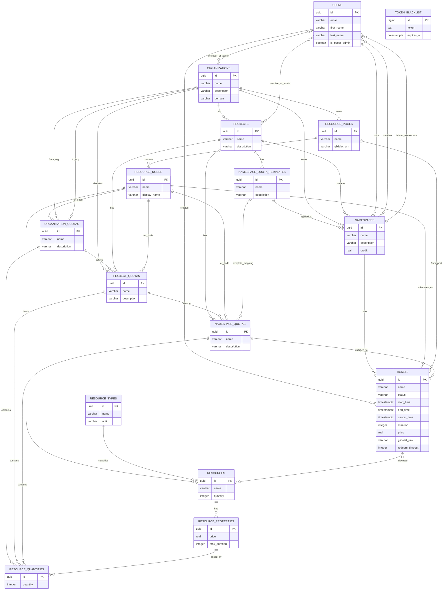

# ER Diagram (Mermaid - Clean)

Clean version: removed audit columns (created_at, updated_at, deleted_at) and FK fields from entity blocks, and used relationships to show connections.

```mermaid
erDiagram
    USERS {
        uuid id PK
        varchar email
        varchar first_name
        varchar last_name
        boolean is_super_admin
    }

    ORGANIZATIONS {
        uuid id PK
        varchar name
        varchar description
        varchar domain
    }

    PROJECTS {
        uuid id PK
        varchar name
        varchar description
    }

    NAMESPACES {
        uuid id PK
        varchar name
        varchar description
        real credit
    }

    RESOURCE_TYPES {
        uuid id PK
        varchar name
        varchar unit
    }

    RESOURCE_POOLS {
        uuid id PK
        varchar name
        varchar glidelet_urn
    }

    RESOURCE_NODES {
        uuid id PK
        varchar name
        varchar display_name
    }

    RESOURCES {
        uuid id PK
        varchar name
        integer quantity
    }

    RESOURCE_PROPERTIES {
        uuid id PK
        real price
        integer max_duration
    }

    ORGANIZATION_QUOTAS {
        uuid id PK
        varchar name
        varchar description
    }

    PROJECT_QUOTAS {
        uuid id PK
        varchar name
        varchar description
    }

    NAMESPACE_QUOTAS {
        uuid id PK
        varchar name
        varchar description
    }

    NAMESPACE_QUOTA_TEMPLATES {
        uuid id PK
        varchar name
        varchar description
    }

    RESOURCE_QUANTITIES {
        uuid id PK
        integer quantity
    }

    TICKETS {
        uuid id PK
        varchar name
        varchar status
        timestamptz start_time
        timestamptz end_time
        timestamptz cancel_time
        integer duration
        real price
        varchar glidelet_urn
        integer redeem_timeout
    }

    TOKEN_BLACKLIST {
        bigint id PK
        text token
        timestamptz expires_at
    }

    ORGANIZATIONS ||--o{ PROJECTS : has
    ORGANIZATIONS ||--o{ RESOURCE_POOLS : owns
    RESOURCE_POOLS ||--o{ RESOURCE_NODES : contains
    RESOURCE_NODES ||--o{ RESOURCES : hosts
    RESOURCE_TYPES ||--o{ RESOURCES : classifies
    RESOURCES ||--o{ RESOURCE_PROPERTIES : has

    RESOURCE_NODES ||--o{ ORGANIZATION_QUOTAS : for_node
    ORGANIZATIONS ||--o{ ORGANIZATION_QUOTAS : from_org
    ORGANIZATIONS ||--o{ ORGANIZATION_QUOTAS : to_org

    ORGANIZATIONS ||--o{ PROJECT_QUOTAS : allocates
    ORGANIZATION_QUOTAS ||--o{ PROJECT_QUOTAS : source
    PROJECTS ||--o{ PROJECT_QUOTAS : has
    RESOURCE_NODES ||--o{ PROJECT_QUOTAS : for_node

    PROJECTS ||--o{ NAMESPACE_QUOTAS : has
    PROJECT_QUOTAS ||--o{ NAMESPACE_QUOTAS : source
    RESOURCE_NODES ||--o{ NAMESPACE_QUOTAS : for_node

    PROJECTS ||--o{ NAMESPACE_QUOTA_TEMPLATES : has
    NAMESPACE_QUOTA_TEMPLATES ||--o{ NAMESPACES : applied_to

    ORGANIZATIONS ||--o{ NAMESPACES : owns
    PROJECTS ||--o{ NAMESPACES : contains
    USERS ||--o{ NAMESPACES : owns
    NAMESPACES ||--o{ USERS : default_namespace

    USERS ||--o{ TICKETS : creates
    NAMESPACES ||--o{ TICKETS : uses
    RESOURCE_NODES ||--o{ TICKETS : schedules_on
    RESOURCE_POOLS ||--o{ TICKETS : from_pool
    NAMESPACE_QUOTAS ||--o{ TICKETS : charged_to

    ORGANIZATION_QUOTAS ||--o{ RESOURCE_QUANTITIES : contains
    PROJECT_QUOTAS ||--o{ RESOURCE_QUANTITIES : contains
    NAMESPACE_QUOTAS ||--o{ RESOURCE_QUANTITIES : contains
    RESOURCE_PROPERTIES ||--o{ RESOURCE_QUANTITIES : priced_by

    USERS }o--o{ ORGANIZATIONS : member_or_admin
    USERS }o--o{ PROJECTS : member_or_admin
    USERS }o--o{ NAMESPACES : member
    TICKETS }o--o{ RESOURCES : allocated
    NAMESPACE_QUOTA_TEMPLATES }o--o{ NAMESPACE_QUOTAS : template_mapping
```
