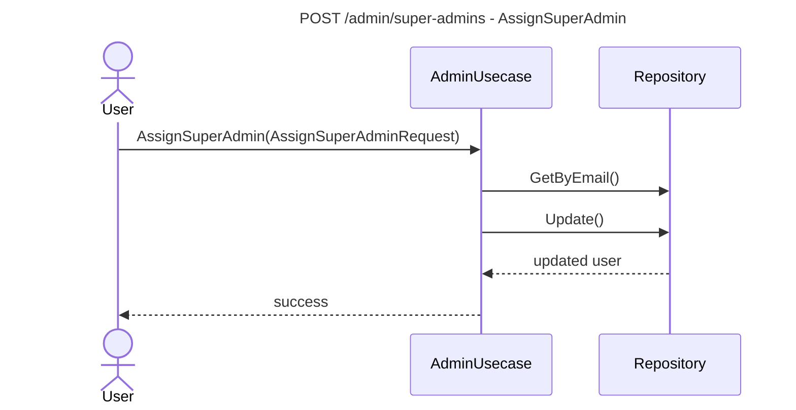
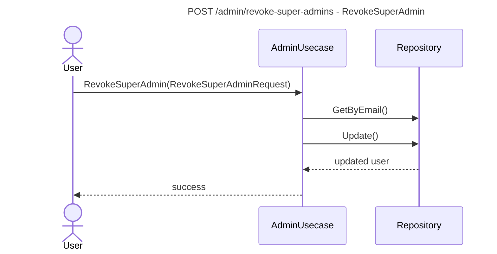

```mermaid
---
title: POST /admin/super-admins - AssignSuperAdmin
---
sequenceDiagram
    actor User
    participant AdminUsecase
    participant Repository

    User->>AdminUsecase: AssignSuperAdmin(AssignSuperAdminRequest)
    AdminUsecase->>Repository: GetByEmail()
    AdminUsecase->>Repository: Update()
    Repository-->>AdminUsecase: updated user
    AdminUsecase-->>User: success
```

```mermaid
---
title: POST /admin/revoke-super-admins - RevokeSuperAdmin
---
sequenceDiagram
    actor User
    participant AdminUsecase
    participant Repository

    User->>AdminUsecase: RevokeSuperAdmin(RevokeSuperAdminRequest)
    AdminUsecase->>Repository: GetByEmail()
    AdminUsecase->>Repository: Update()
    Repository-->>AdminUsecase: updated user
    AdminUsecase-->>User: success
```
