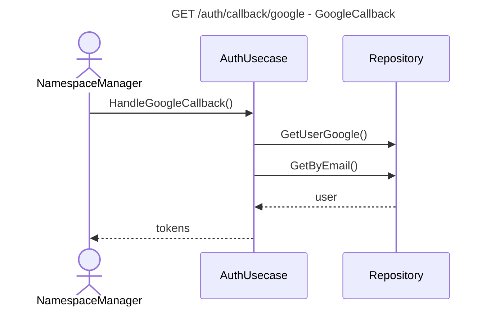
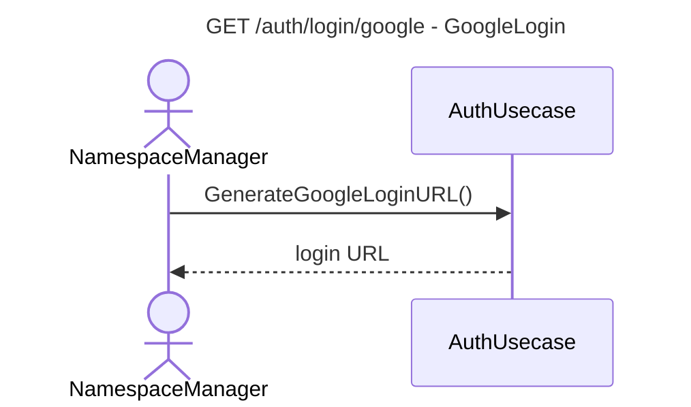
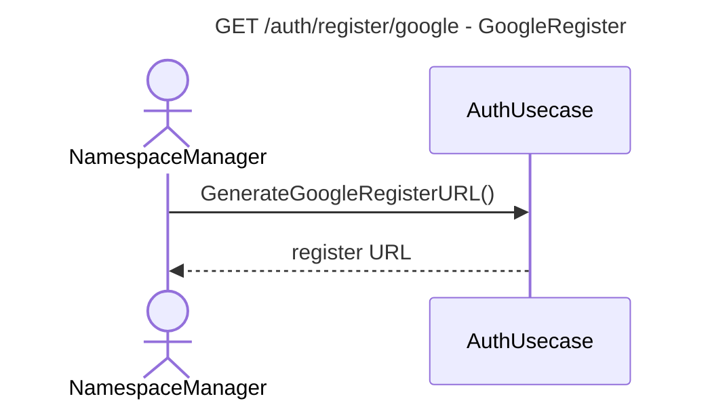
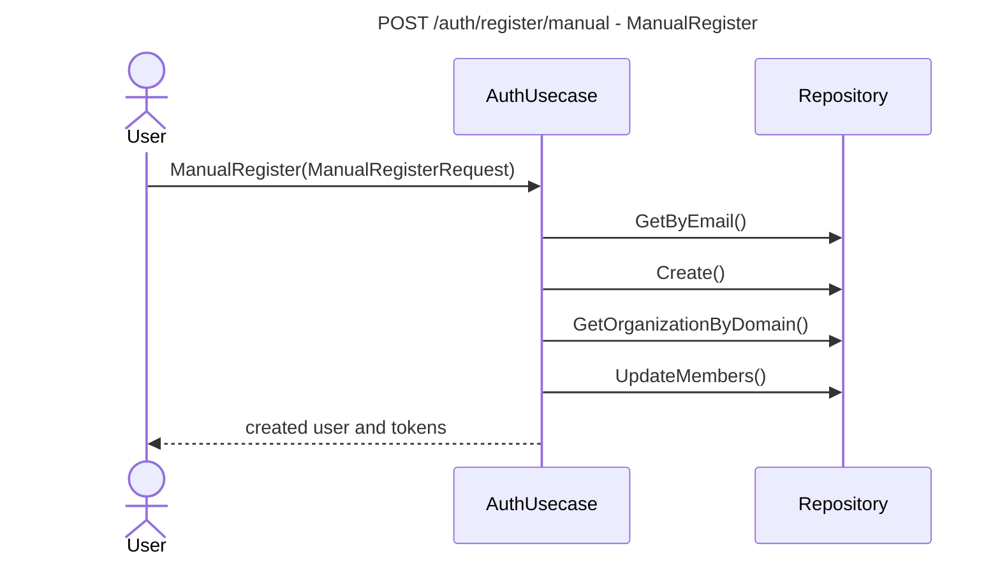
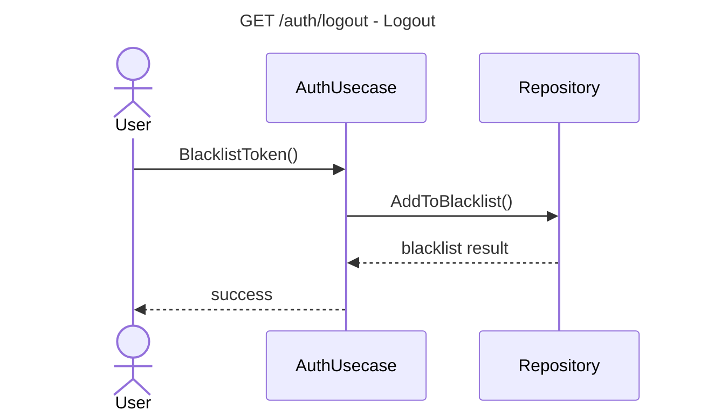
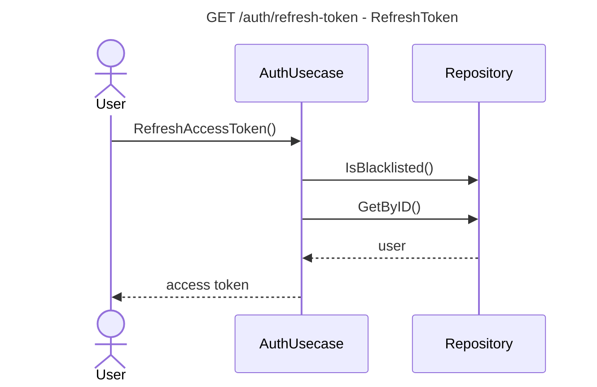
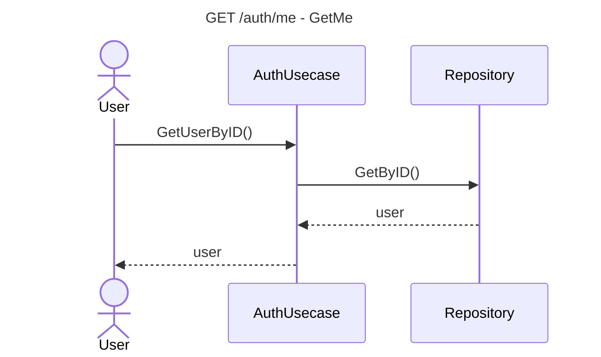

```mermaid
---
title: GET /auth/callback/google - GoogleCallback
---
sequenceDiagram
    actor NamespaceManager
    participant AuthUsecase
    participant Repository

    NamespaceManager->>AuthUsecase: HandleGoogleCallback()
    AuthUsecase->>Repository: GetUserGoogle()
    AuthUsecase->>Repository: GetByEmail()
    Repository-->>AuthUsecase: user
    AuthUsecase-->>NamespaceManager: tokens
```

```mermaid
---
title: GET /auth/login/google - GoogleLogin
---
sequenceDiagram
    actor NamespaceManager
    participant AuthUsecase

    NamespaceManager->>AuthUsecase: GenerateGoogleLoginURL()
    AuthUsecase-->>NamespaceManager: login URL
```

```mermaid
---
title: GET /auth/register/google - GoogleRegister
---
sequenceDiagram
    actor NamespaceManager
    participant AuthUsecase

    NamespaceManager->>AuthUsecase: GenerateGoogleRegisterURL()
    AuthUsecase-->>NamespaceManager: register URL
```

```mermaid
---
title: POST /auth/register/manual - ManualRegister
---
sequenceDiagram
    actor User
    participant AuthUsecase
    participant Repository

    User->>AuthUsecase: ManualRegister(ManualRegisterRequest)
    AuthUsecase->>Repository: GetByEmail()
    AuthUsecase->>Repository: Create()
    AuthUsecase->>Repository: GetOrganizationByDomain()
    AuthUsecase->>Repository: UpdateMembers()
    AuthUsecase-->>User: created user and tokens
```

```mermaid
---
title: GET /auth/logout - Logout
---
sequenceDiagram
    actor User
    participant AuthUsecase
    participant Repository

    User->>AuthUsecase: BlacklistToken()
    AuthUsecase->>Repository: AddToBlacklist()
    Repository-->>AuthUsecase: blacklist result
    AuthUsecase-->>User: success
```

```mermaid
---
title: GET /auth/refresh-token - RefreshToken
---
sequenceDiagram
    actor User
    participant AuthUsecase
    participant Repository

    User->>AuthUsecase: RefreshAccessToken()
    AuthUsecase->>Repository: IsBlacklisted()
    AuthUsecase->>Repository: GetByID()
    Repository-->>AuthUsecase: user
    AuthUsecase-->>User: access token
```

```mermaid
---
title: GET /auth/me - GetMe
---
sequenceDiagram
    actor User
    participant AuthUsecase
    participant Repository

    User->>AuthUsecase: GetUserByID()
    AuthUsecase->>Repository: GetByID()
    Repository-->>AuthUsecase: user
    AuthUsecase-->>User: user
```
