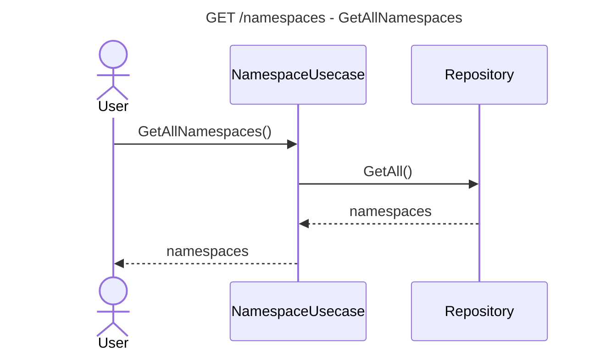
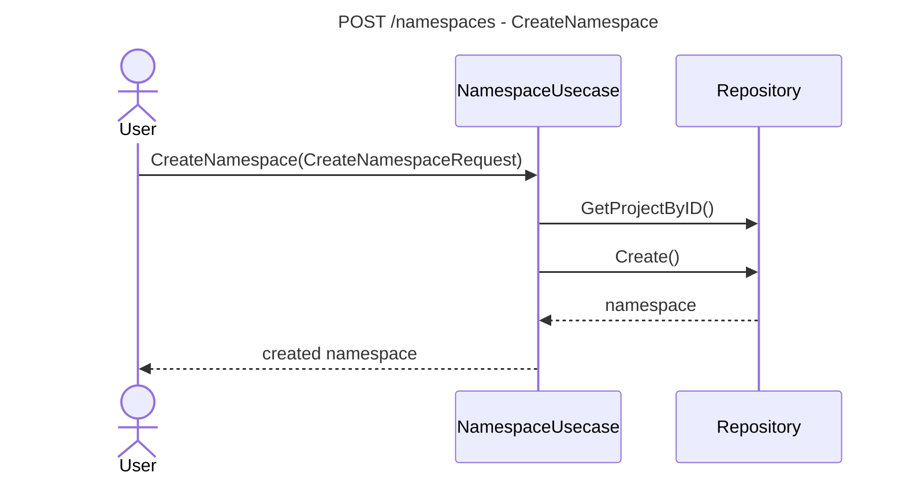
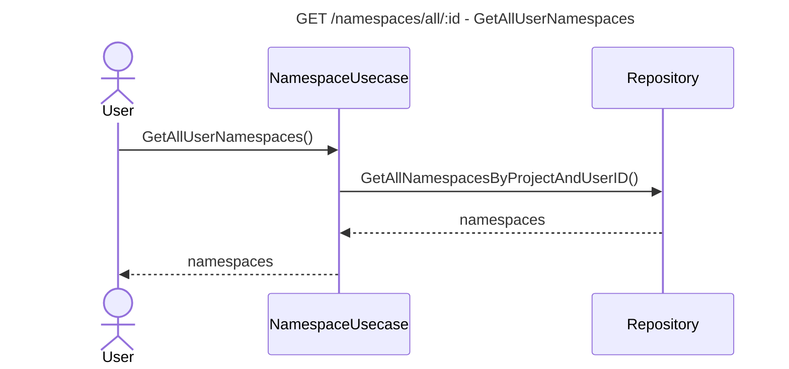
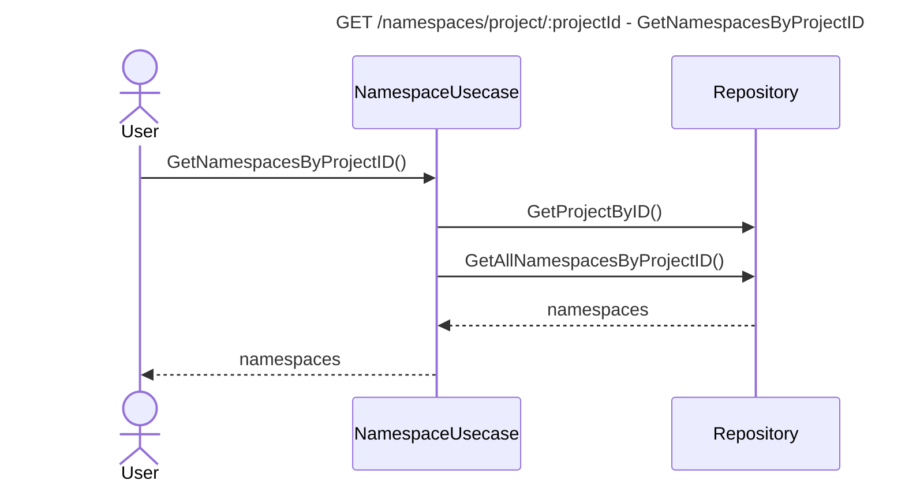
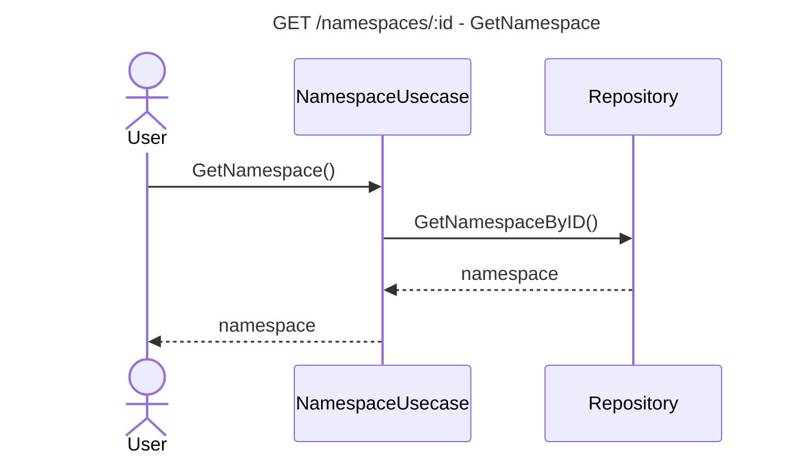
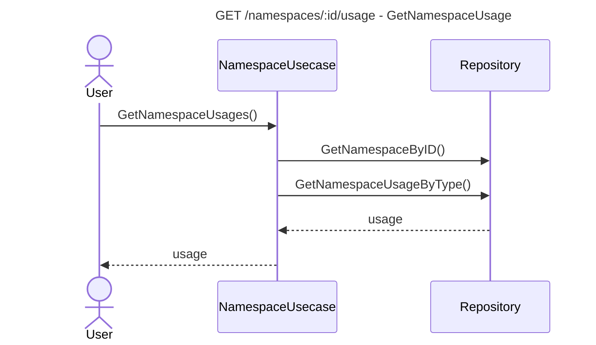
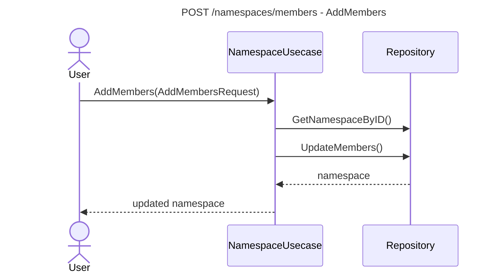
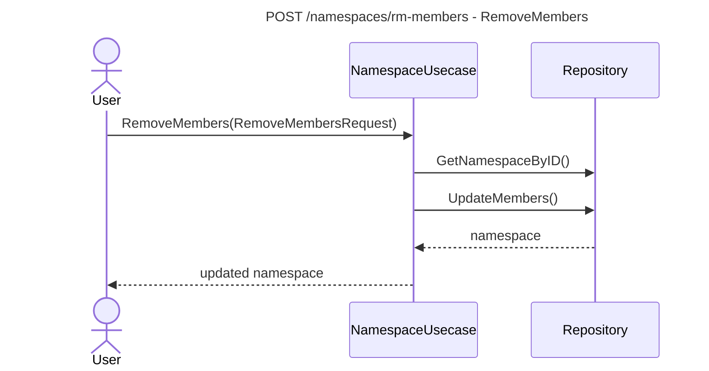
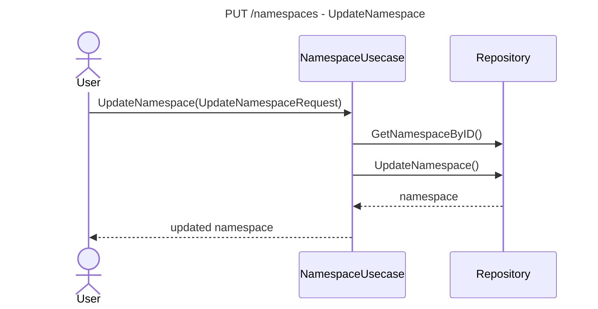
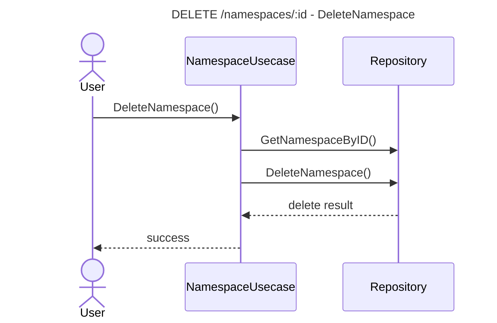

```mermaid
---
title: GET /namespaces - GetAllNamespaces
---
sequenceDiagram
    actor User
    participant NamespaceUsecase
    participant Repository

    User->>NamespaceUsecase: GetAllNamespaces()
    NamespaceUsecase->>Repository: GetAll()
    Repository-->>NamespaceUsecase: namespaces
    NamespaceUsecase-->>User: namespaces
```

```mermaid
---
title: POST /namespaces - CreateNamespace
---
sequenceDiagram
    actor User
    participant NamespaceUsecase
    participant Repository

    User->>NamespaceUsecase: CreateNamespace(CreateNamespaceRequest)
    NamespaceUsecase->>Repository: GetProjectByID()
    NamespaceUsecase->>Repository: Create()
    Repository-->>NamespaceUsecase: namespace
    NamespaceUsecase-->>User: created namespace
```

```mermaid
---
title: GET /namespaces/all/:id - GetAllUserNamespaces
---
sequenceDiagram
    actor User
    participant NamespaceUsecase
    participant Repository

    User->>NamespaceUsecase: GetAllUserNamespaces()
    NamespaceUsecase->>Repository: GetAllNamespacesByProjectAndUserID()
    Repository-->>NamespaceUsecase: namespaces
    NamespaceUsecase-->>User: namespaces
```

```mermaid
---
title: GET /namespaces/project/:projectId - GetNamespacesByProjectID
---
sequenceDiagram
    actor User
    participant NamespaceUsecase
    participant Repository

    User->>NamespaceUsecase: GetNamespacesByProjectID()
    NamespaceUsecase->>Repository: GetProjectByID()
    NamespaceUsecase->>Repository: GetAllNamespacesByProjectID()
    Repository-->>NamespaceUsecase: namespaces
    NamespaceUsecase-->>User: namespaces
```

```mermaid
---
title: GET /namespaces/:id - GetNamespace
---
sequenceDiagram
    actor User
    participant NamespaceUsecase
    participant Repository

    User->>NamespaceUsecase: GetNamespace()
    NamespaceUsecase->>Repository: GetNamespaceByID()
    Repository-->>NamespaceUsecase: namespace
    NamespaceUsecase-->>User: namespace
```

```mermaid
---
title: GET /namespaces/:id/usage - GetNamespaceUsage
---
sequenceDiagram
    actor User
    participant NamespaceUsecase
    participant Repository

    User->>NamespaceUsecase: GetNamespaceUsages()
    NamespaceUsecase->>Repository: GetNamespaceByID()
    NamespaceUsecase->>Repository: GetNamespaceUsageByType()
    Repository-->>NamespaceUsecase: usage
    NamespaceUsecase-->>User: usage
```

```mermaid
---
title: POST /namespaces/members - AddMembers
---
sequenceDiagram
    actor User
    participant NamespaceUsecase
    participant Repository

    User->>NamespaceUsecase: AddMembers(AddMembersRequest)
    NamespaceUsecase->>Repository: GetNamespaceByID()
    NamespaceUsecase->>Repository: UpdateMembers()
    Repository-->>NamespaceUsecase: namespace
    NamespaceUsecase-->>User: updated namespace
```

```mermaid
---
title: POST /namespaces/rm-members - RemoveMembers
---
sequenceDiagram
    actor User
    participant NamespaceUsecase
    participant Repository

    User->>NamespaceUsecase: RemoveMembers(RemoveMembersRequest)
    NamespaceUsecase->>Repository: GetNamespaceByID()
    NamespaceUsecase->>Repository: UpdateMembers()
    Repository-->>NamespaceUsecase: namespace
    NamespaceUsecase-->>User: updated namespace
```

```mermaid
---
title: PUT /namespaces - UpdateNamespace
---
sequenceDiagram
    actor User
    participant NamespaceUsecase
    participant Repository

    User->>NamespaceUsecase: UpdateNamespace(UpdateNamespaceRequest)
    NamespaceUsecase->>Repository: GetNamespaceByID()
    NamespaceUsecase->>Repository: UpdateNamespace()
    Repository-->>NamespaceUsecase: namespace
    NamespaceUsecase-->>User: updated namespace
```

```mermaid
---
title: DELETE /namespaces/:id - DeleteNamespace
---
sequenceDiagram
    actor User
    participant NamespaceUsecase
    participant Repository

    User->>NamespaceUsecase: DeleteNamespace()
    NamespaceUsecase->>Repository: GetNamespaceByID()
    NamespaceUsecase->>Repository: DeleteNamespace()
    Repository-->>NamespaceUsecase: delete result
    NamespaceUsecase-->>User: success
```
