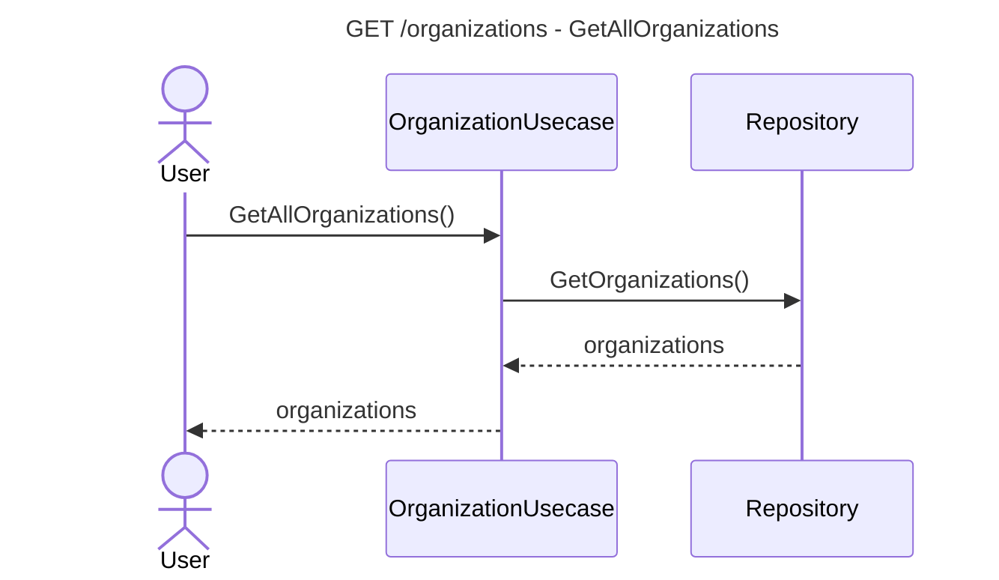
```mermaid
---
title: GET /organizations - GetAllOrganizations
---
sequenceDiagram
    actor User
    participant OrganizationUsecase
    participant Repository

    User->>OrganizationUsecase: GetAllOrganizations()
    OrganizationUsecase->>Repository: GetOrganizations()
    Repository-->>OrganizationUsecase: organizations
    OrganizationUsecase-->>User: organizations
```

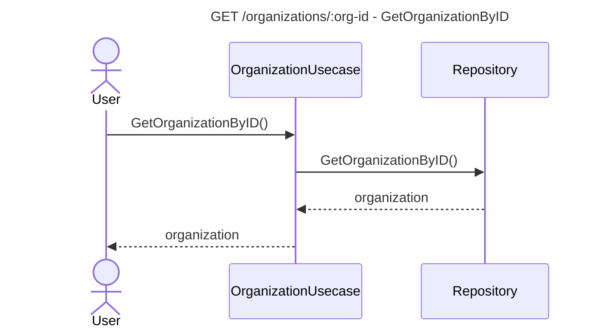
```mermaid
---
title: GET /organizations/:org-id - GetOrganizationByID
---
sequenceDiagram
    actor User
    participant OrganizationUsecase
    participant Repository

    User->>OrganizationUsecase: GetOrganizationByID()
    OrganizationUsecase->>Repository: GetOrganizationByID()
    Repository-->>OrganizationUsecase: organization
    OrganizationUsecase-->>User: organization
```

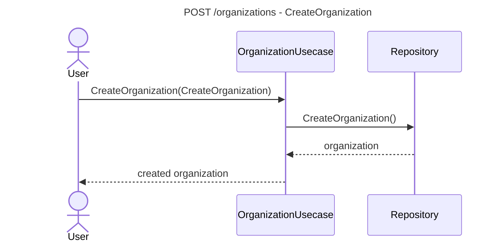
```mermaid
---
title: POST /organizations - CreateOrganization
---
sequenceDiagram
    actor User
    participant OrganizationUsecase
    participant Repository

    User->>OrganizationUsecase: CreateOrganization(CreateOrganization)
    OrganizationUsecase->>Repository: CreateOrganization()
    Repository-->>OrganizationUsecase: organization
    OrganizationUsecase-->>User: created organization
```

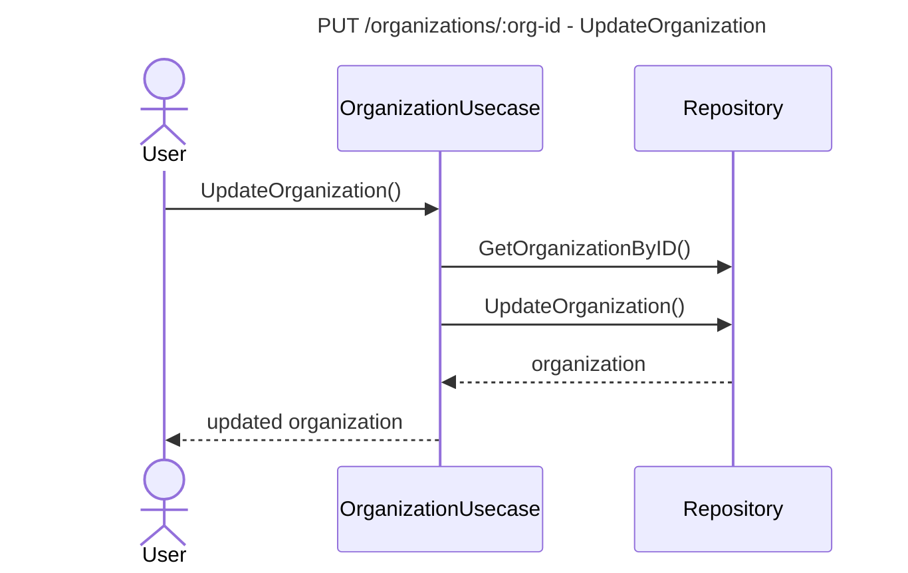
```mermaid
---
title: PUT /organizations/:org-id - UpdateOrganization
---
sequenceDiagram
    actor User
    participant OrganizationUsecase
    participant Repository

    User->>OrganizationUsecase: UpdateOrganization()
    OrganizationUsecase->>Repository: GetOrganizationByID()
    OrganizationUsecase->>Repository: UpdateOrganization()
    Repository-->>OrganizationUsecase: organization
    OrganizationUsecase-->>User: updated organization
```

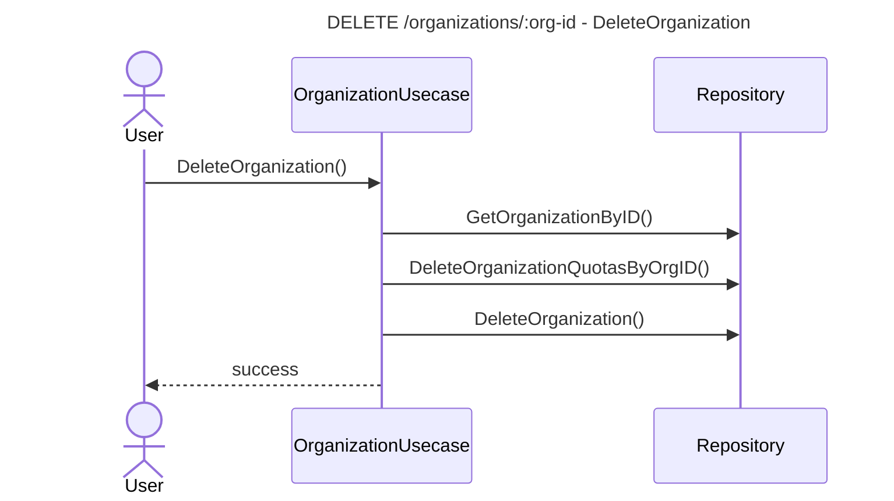
```mermaid
---
title: DELETE /organizations/:org-id - DeleteOrganization
---
sequenceDiagram
    actor User
    participant OrganizationUsecase
    participant Repository

    User->>OrganizationUsecase: DeleteOrganization()
    OrganizationUsecase->>Repository: GetOrganizationByID()
    OrganizationUsecase->>Repository: DeleteOrganizationQuotasByOrgID()
    OrganizationUsecase->>Repository: DeleteOrganization()
    OrganizationUsecase-->>User: success
```

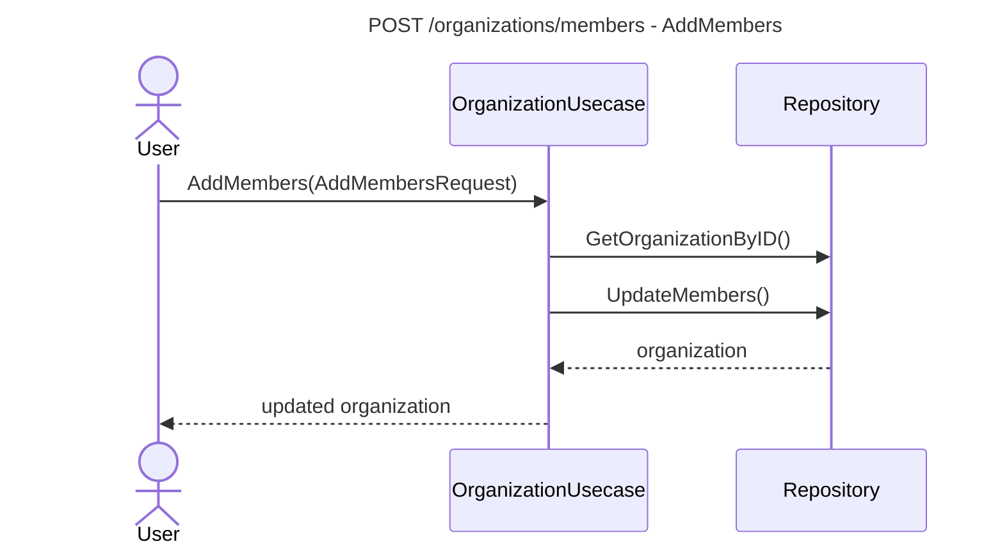
```mermaid
---
title: POST /organizations/members - AddMembers
---
sequenceDiagram
    actor User
    participant OrganizationUsecase
    participant Repository

    User->>OrganizationUsecase: AddMembers(AddMembersRequest)
    OrganizationUsecase->>Repository: GetOrganizationByID()
    OrganizationUsecase->>Repository: UpdateMembers()
    Repository-->>OrganizationUsecase: organization
    OrganizationUsecase-->>User: updated organization
```

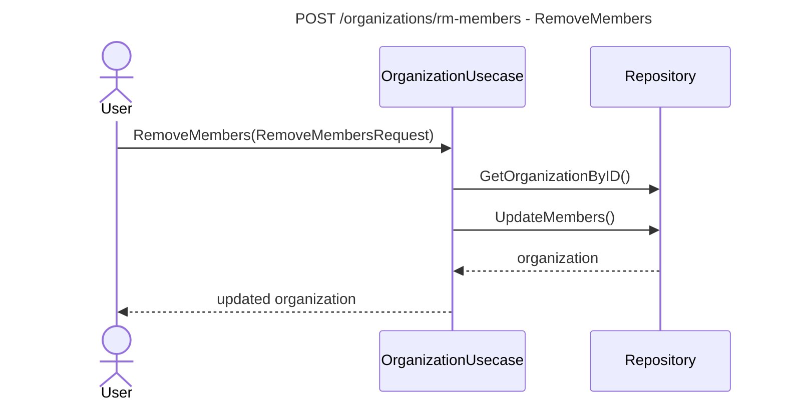
```mermaid
---
title: POST /organizations/rm-members - RemoveMembers
---
sequenceDiagram
    actor User
    participant OrganizationUsecase
    participant Repository

    User->>OrganizationUsecase: RemoveMembers(RemoveMembersRequest)
    OrganizationUsecase->>Repository: GetOrganizationByID()
    OrganizationUsecase->>Repository: UpdateMembers()
    Repository-->>OrganizationUsecase: organization
    OrganizationUsecase-->>User: updated organization
```

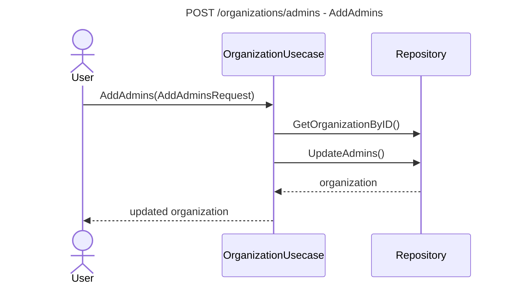
```mermaid
---
title: POST /organizations/admins - AddAdmins
---
sequenceDiagram
    actor User
    participant OrganizationUsecase
    participant Repository

    User->>OrganizationUsecase: AddAdmins(AddAdminsRequest)
    OrganizationUsecase->>Repository: GetOrganizationByID()
    OrganizationUsecase->>Repository: UpdateAdmins()
    Repository-->>OrganizationUsecase: organization
    OrganizationUsecase-->>User: updated organization
```

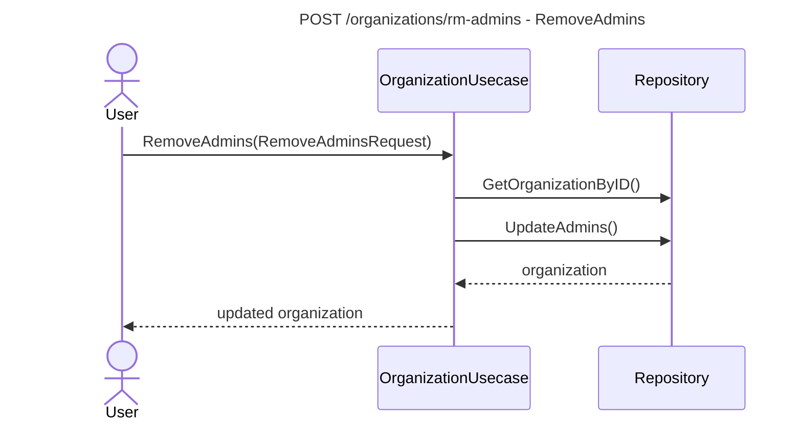
```mermaid
---
title: POST /organizations/rm-admins - RemoveAdmins
---
sequenceDiagram
    actor User
    participant OrganizationUsecase
    participant Repository

    User->>OrganizationUsecase: RemoveAdmins(RemoveAdminsRequest)
    OrganizationUsecase->>Repository: GetOrganizationByID()
    OrganizationUsecase->>Repository: UpdateAdmins()
    Repository-->>OrganizationUsecase: organization
    OrganizationUsecase-->>User: updated organization
```

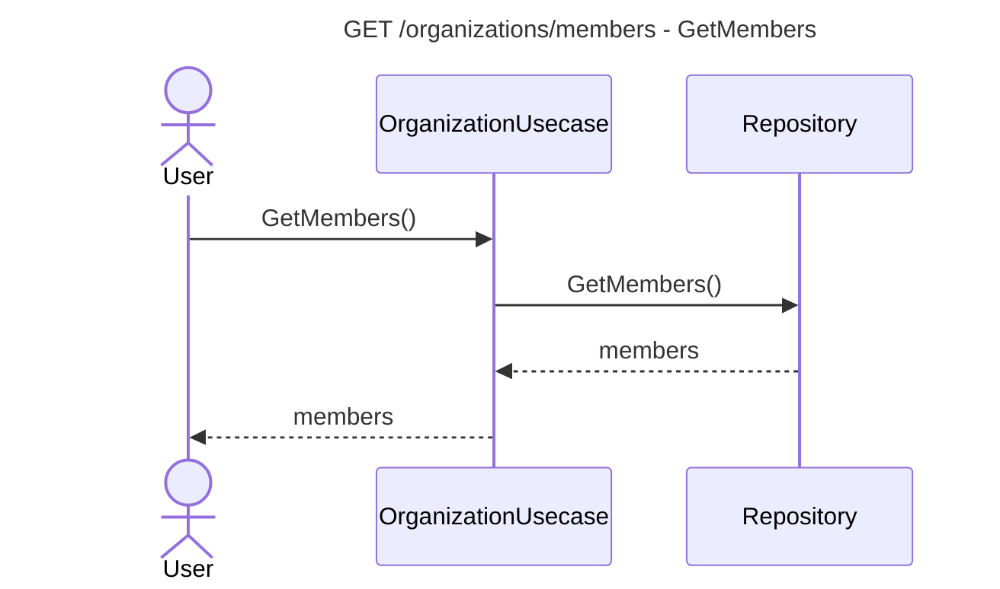
```mermaid
---
title: GET /organizations/members - GetMembers
---
sequenceDiagram
    actor User
    participant OrganizationUsecase
    participant Repository

    User->>OrganizationUsecase: GetMembers()
    OrganizationUsecase->>Repository: GetMembers()
    Repository-->>OrganizationUsecase: members
    OrganizationUsecase-->>User: members
```

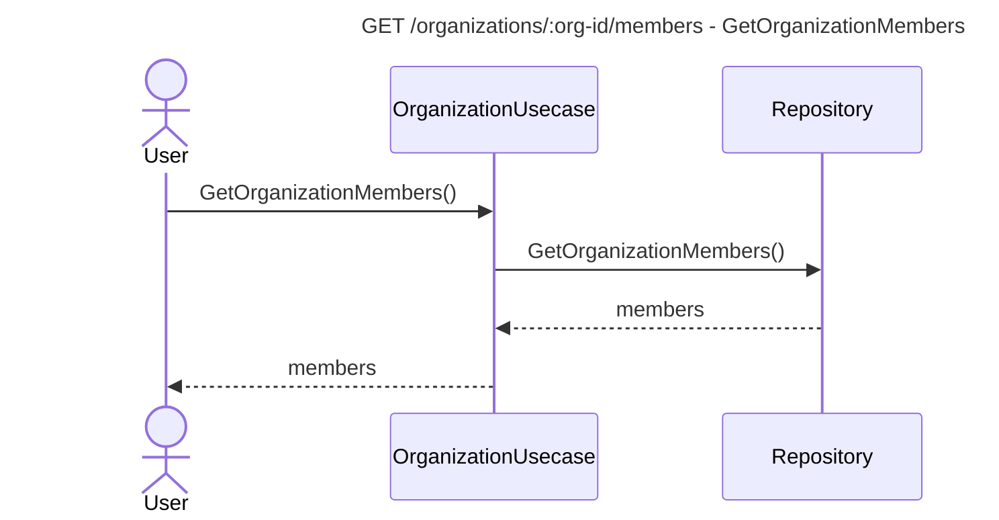
```mermaid
---
title: GET /organizations/:org-id/members - GetOrganizationMembers
---
sequenceDiagram
    actor User
    participant OrganizationUsecase
    participant Repository

    User->>OrganizationUsecase: GetOrganizationMembers()
    OrganizationUsecase->>Repository: GetOrganizationMembers()
    Repository-->>OrganizationUsecase: members
    OrganizationUsecase-->>User: members
```
