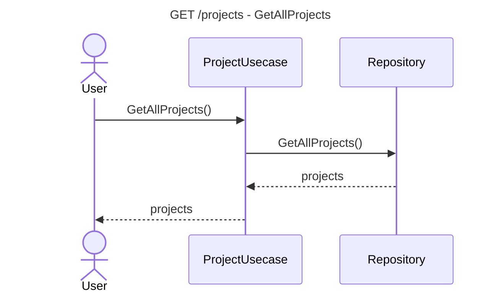
```mermaid
---
title: GET /projects - GetAllProjects
---
sequenceDiagram
    actor User
    participant ProjectUsecase
    participant Repository

    User->>ProjectUsecase: GetAllProjects()
    ProjectUsecase->>Repository: GetAllProjects()
    Repository-->>ProjectUsecase: projects
    ProjectUsecase-->>User: projects
```

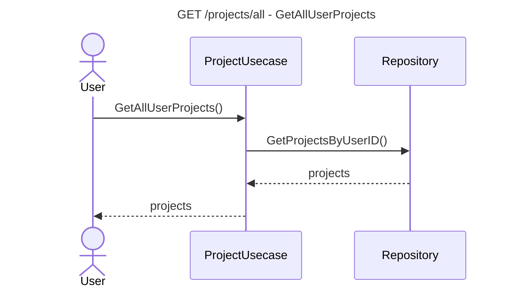
```mermaid
---
title: GET /projects/all - GetAllUserProjects
---
sequenceDiagram
    actor User
    participant ProjectUsecase
    participant Repository

    User->>ProjectUsecase: GetAllUserProjects()
    ProjectUsecase->>Repository: GetProjectsByUserID()
    Repository-->>ProjectUsecase: projects
    ProjectUsecase-->>User: projects
```

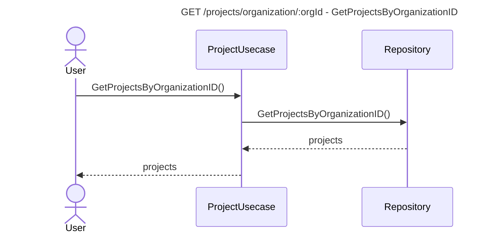
```mermaid
---
title: GET /projects/organization/:orgId - GetProjectsByOrganizationID
---
sequenceDiagram
    actor User
    participant ProjectUsecase
    participant Repository

    User->>ProjectUsecase: GetProjectsByOrganizationID()
    ProjectUsecase->>Repository: GetProjectsByOrganizationID()
    Repository-->>ProjectUsecase: projects
    ProjectUsecase-->>User: projects
```

```mermaid
---
title: GET /projects/:id - GetProject
---
sequenceDiagram
    actor User
    participant ProjectUsecase
    participant Repository

    User->>ProjectUsecase: GetProjectByID()
    ProjectUsecase->>Repository: GetProjectByID()
    Repository-->>ProjectUsecase: project
    ProjectUsecase-->>User: project
```

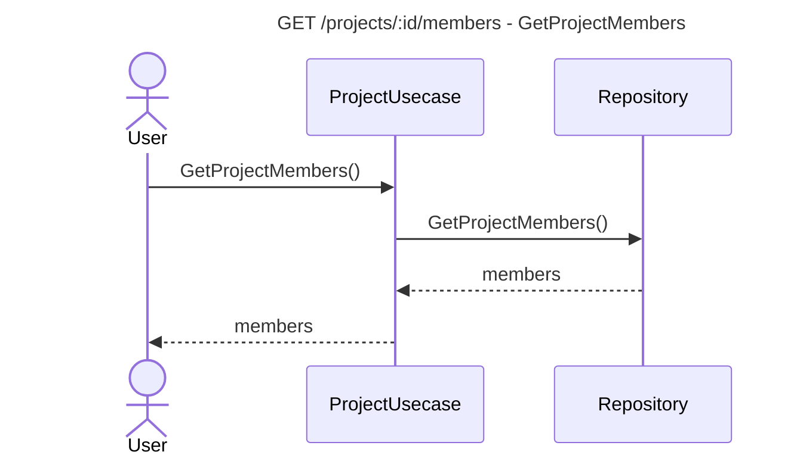
```mermaid
---
title: GET /projects/:id/members - GetProjectMembers
---
sequenceDiagram
    actor User
    participant ProjectUsecase
    participant Repository

    User->>ProjectUsecase: GetProjectMembers()
    ProjectUsecase->>Repository: GetProjectMembers()
    Repository-->>ProjectUsecase: members
    ProjectUsecase-->>User: members
```

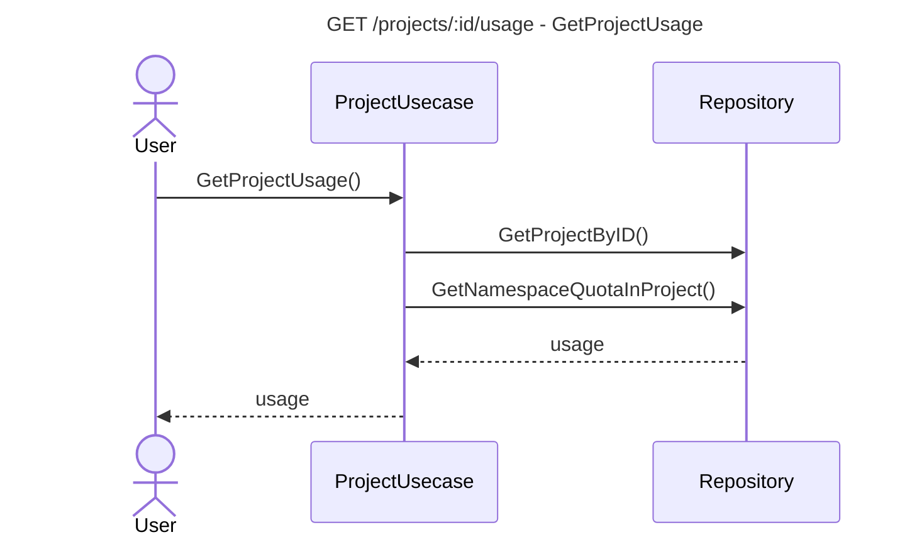
```mermaid
---
title: GET /projects/:id/usage - GetProjectUsage
---
sequenceDiagram
    actor User
    participant ProjectUsecase
    participant Repository

    User->>ProjectUsecase: GetProjectUsage()
    ProjectUsecase->>Repository: GetProjectByID()
    ProjectUsecase->>Repository: GetNamespaceQuotaInProject()
    Repository-->>ProjectUsecase: usage
    ProjectUsecase-->>User: usage
```

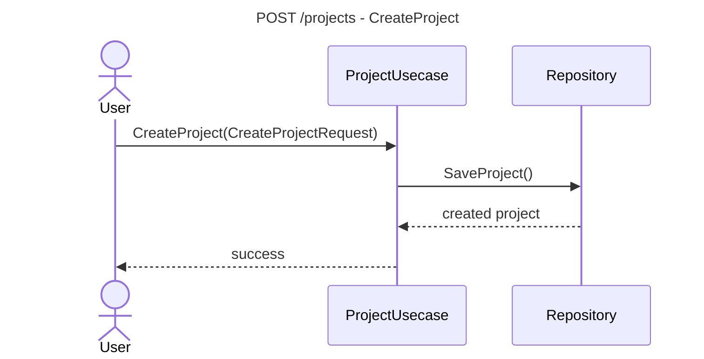
```mermaid
---
title: POST /projects - CreateProject
---
sequenceDiagram
    actor User
    participant ProjectUsecase
    participant Repository

    User->>ProjectUsecase: CreateProject(CreateProjectRequest)
    ProjectUsecase->>Repository: SaveProject()
    Repository-->>ProjectUsecase: created project
    ProjectUsecase-->>User: success
```

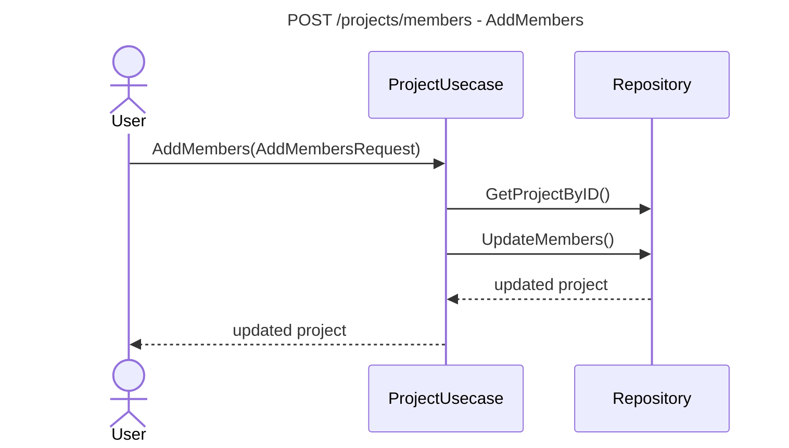
```mermaid
---
title: POST /projects/members - AddMembers
---
sequenceDiagram
    actor User
    participant ProjectUsecase
    participant Repository

    User->>ProjectUsecase: AddMembers(AddMembersRequest)
    ProjectUsecase->>Repository: GetProjectByID()
    ProjectUsecase->>Repository: UpdateMembers()
    Repository-->>ProjectUsecase: updated project
    ProjectUsecase-->>User: updated project
```

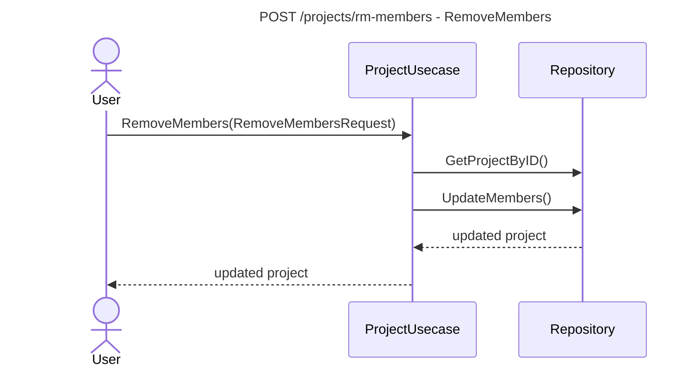
```mermaid
---
title: POST /projects/rm-members - RemoveMembers
---
sequenceDiagram
    actor User
    participant ProjectUsecase
    participant Repository

    User->>ProjectUsecase: RemoveMembers(RemoveMembersRequest)
    ProjectUsecase->>Repository: GetProjectByID()
    ProjectUsecase->>Repository: UpdateMembers()
    Repository-->>ProjectUsecase: updated project
    ProjectUsecase-->>User: updated project
```

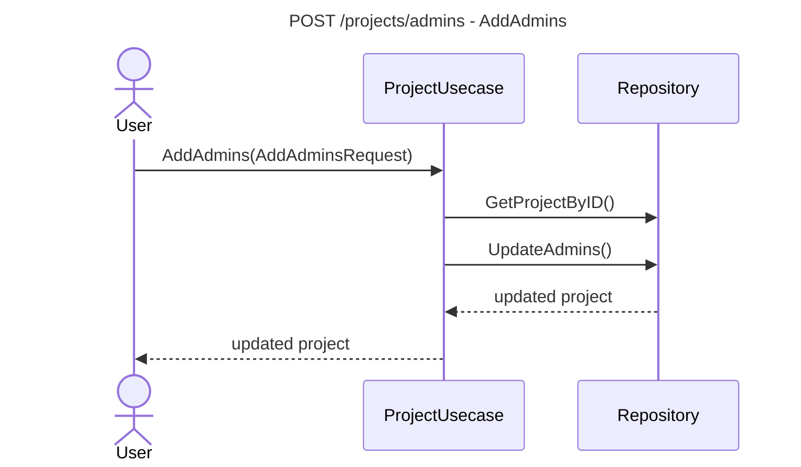
```mermaid
---
title: POST /projects/admins - AddAdmins
---
sequenceDiagram
    actor User
    participant ProjectUsecase
    participant Repository

    User->>ProjectUsecase: AddAdmins(AddAdminsRequest)
    ProjectUsecase->>Repository: GetProjectByID()
    ProjectUsecase->>Repository: UpdateAdmins()
    Repository-->>ProjectUsecase: updated project
    ProjectUsecase-->>User: updated project
```

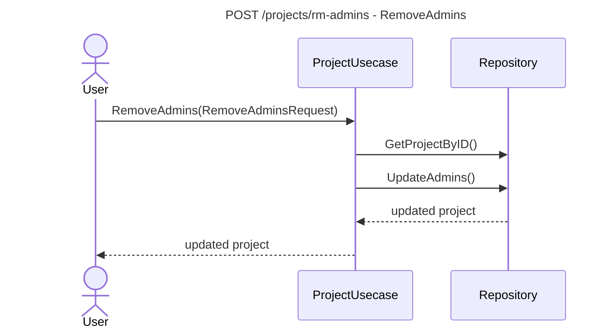
```mermaid
---
title: POST /projects/rm-admins - RemoveAdmins
---
sequenceDiagram
    actor User
    participant ProjectUsecase
    participant Repository

    User->>ProjectUsecase: RemoveAdmins(RemoveAdminsRequest)
    ProjectUsecase->>Repository: GetProjectByID()
    ProjectUsecase->>Repository: UpdateAdmins()
    Repository-->>ProjectUsecase: updated project
    ProjectUsecase-->>User: updated project
```

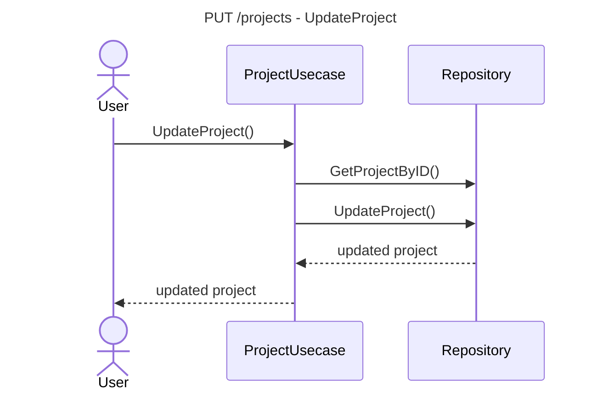
```mermaid
---
title: PUT /projects - UpdateProject
---
sequenceDiagram
    actor User
    participant ProjectUsecase
    participant Repository

    User->>ProjectUsecase: UpdateProject()
    ProjectUsecase->>Repository: GetProjectByID()
    ProjectUsecase->>Repository: UpdateProject()
    Repository-->>ProjectUsecase: updated project
    ProjectUsecase-->>User: updated project
```

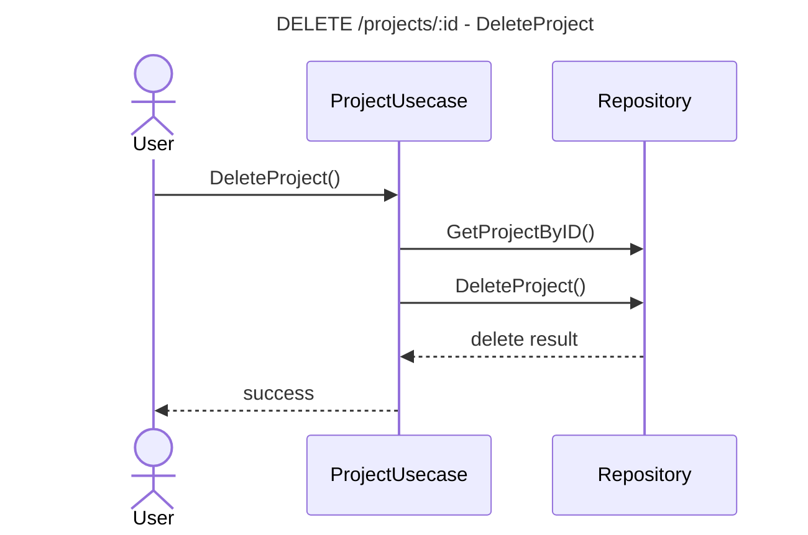
```mermaid
---
title: DELETE /projects/:id - DeleteProject
---
sequenceDiagram
    actor User
    participant ProjectUsecase
    participant Repository

    User->>ProjectUsecase: DeleteProject()
    ProjectUsecase->>Repository: GetProjectByID()
    ProjectUsecase->>Repository: DeleteProject()
    Repository-->>ProjectUsecase: delete result
    ProjectUsecase-->>User: success
```
