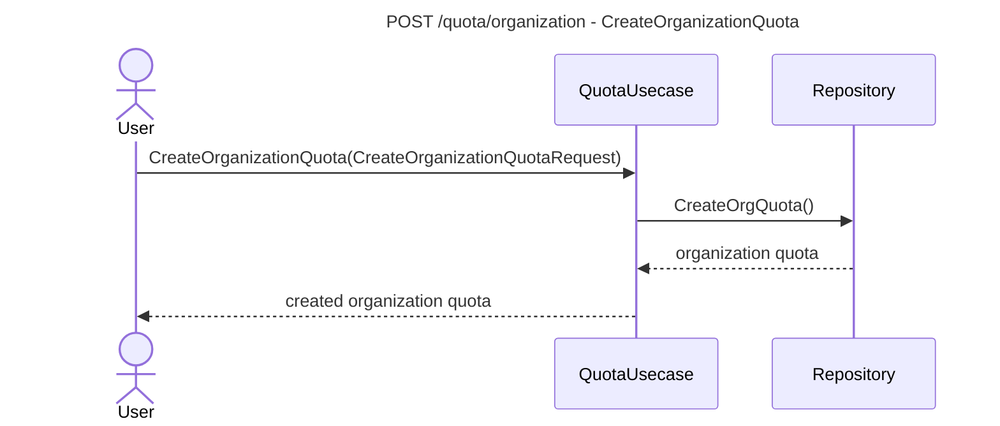

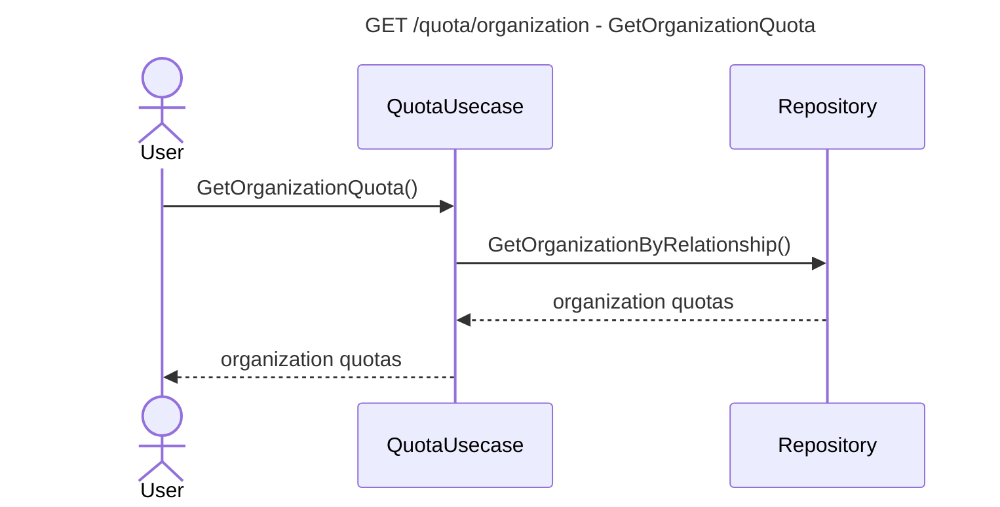

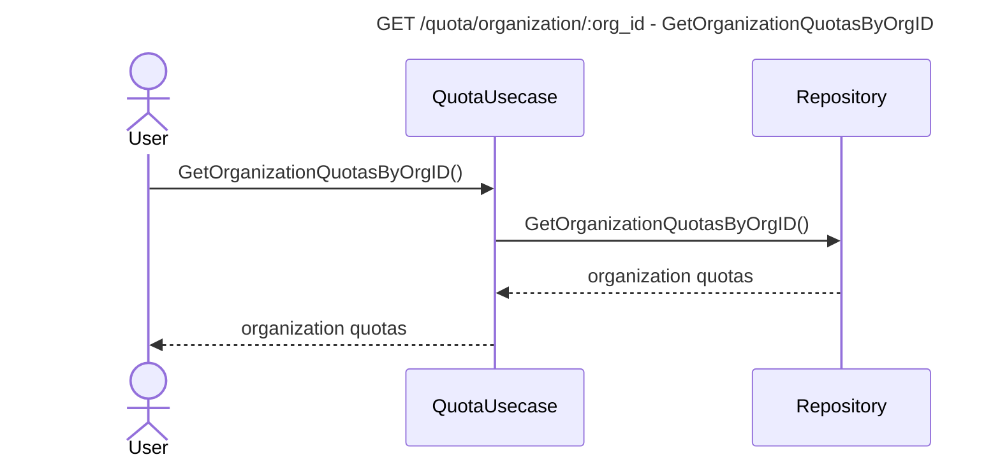

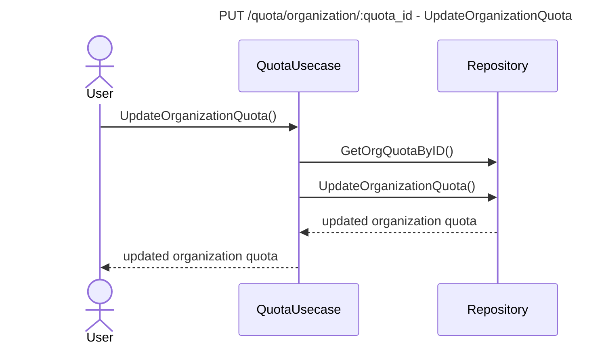

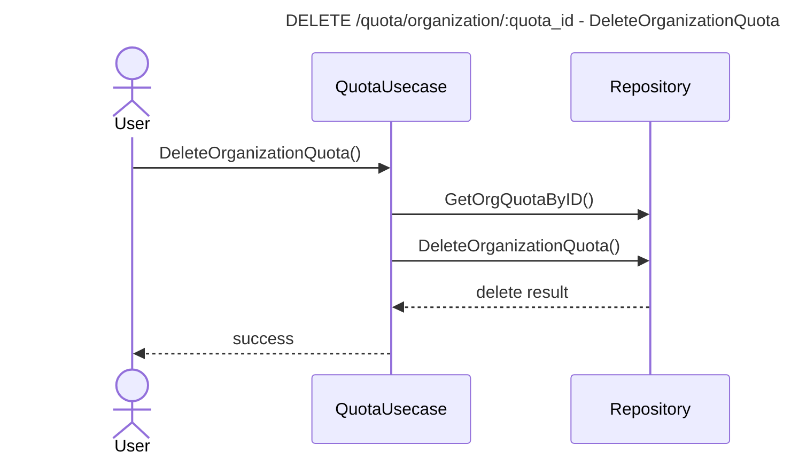

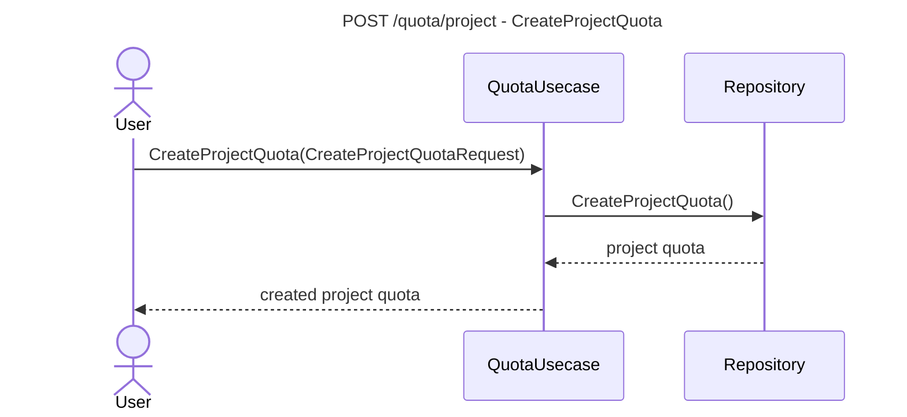


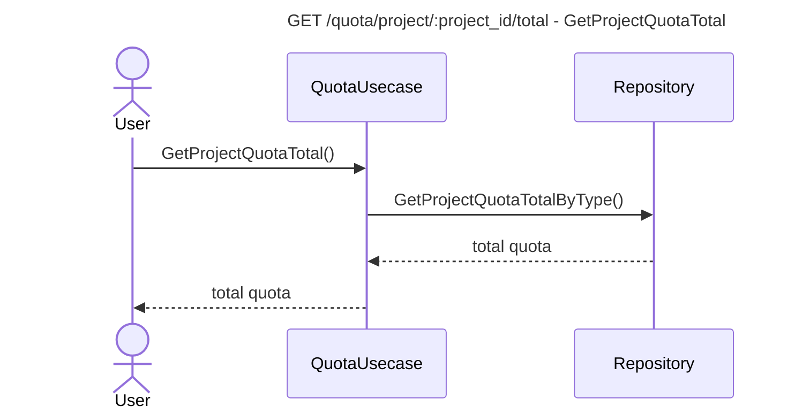

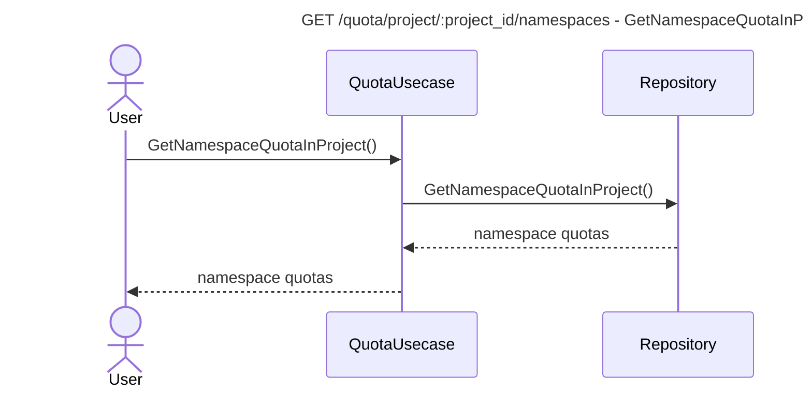

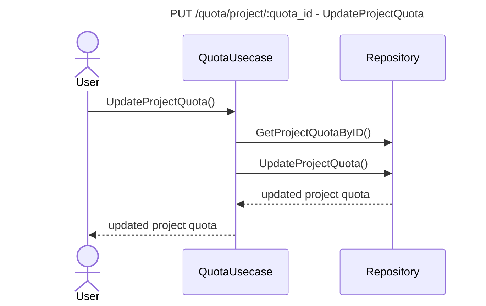

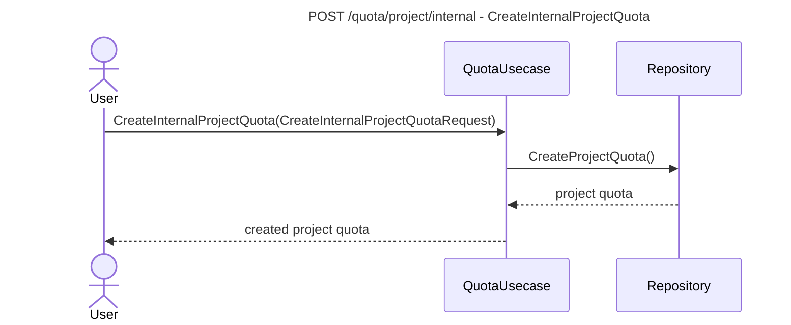

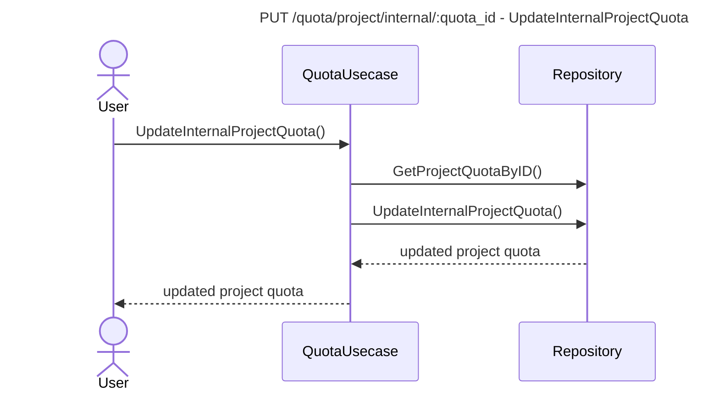

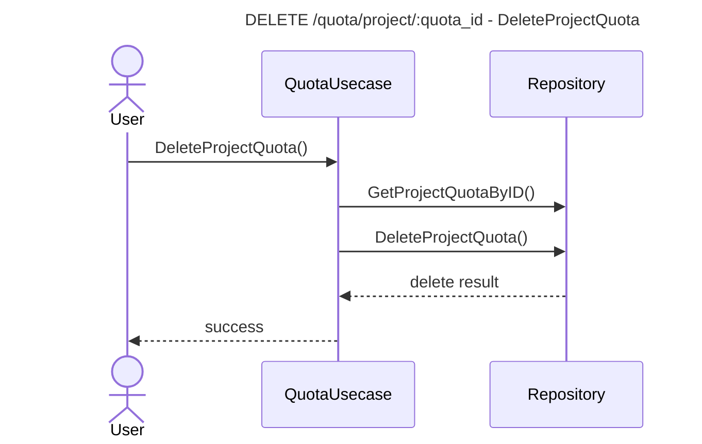

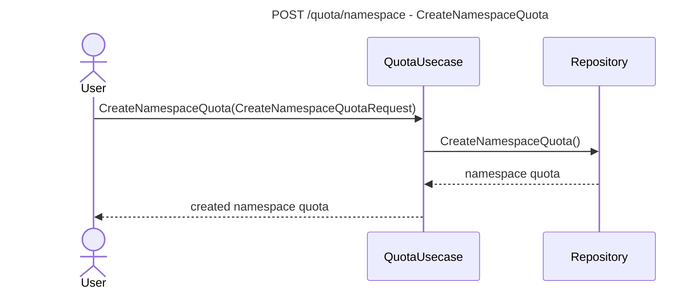

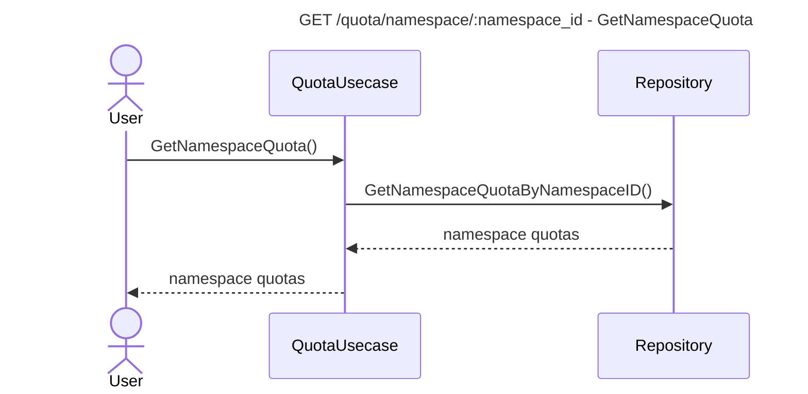

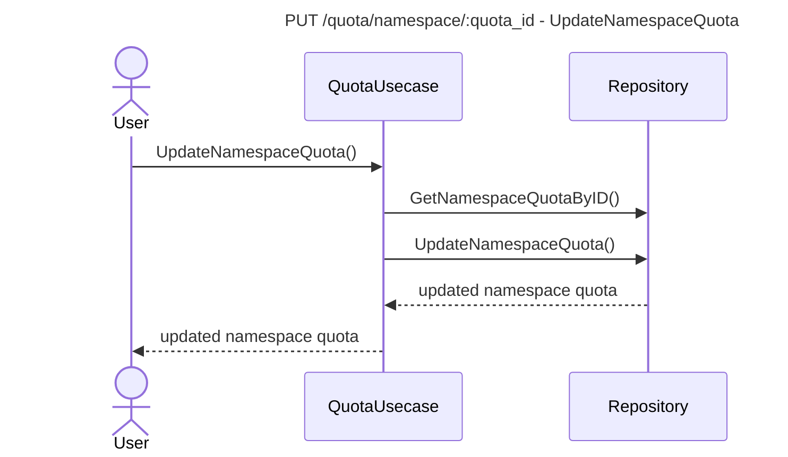

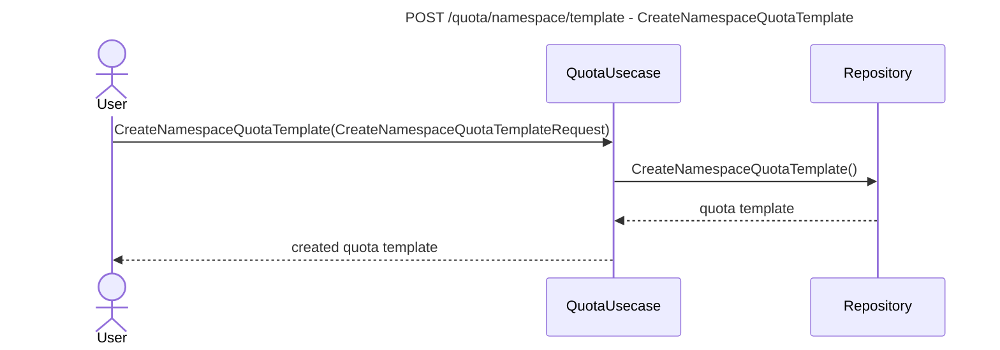

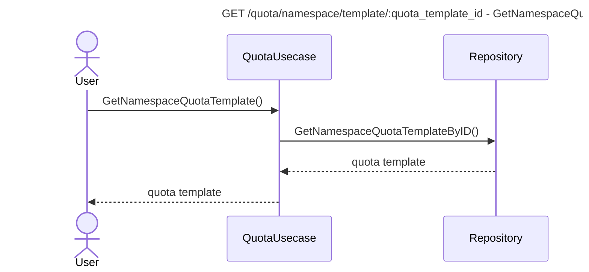

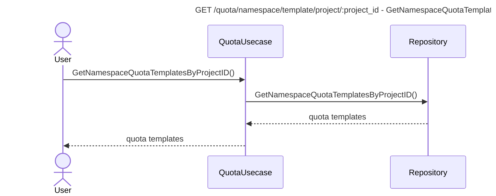

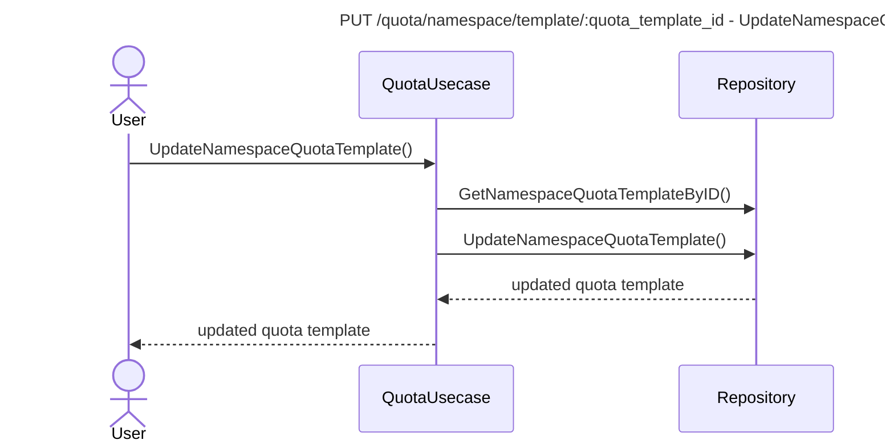

```mermaid
---
title: POST /quota/namespace/template/assign - AssignQuotaTemplateToNamespace
---
sequenceDiagram
    actor User
    participant QuotaUsecase
    participant Repository

    User->>QuotaUsecase: AssignQuotaTemplateToNamespace(AssignQuotaToNamespaceRequest)
    QuotaUsecase->>Repository: AssignQuotaTemplateToNamespace()
    Repository-->>QuotaUsecase: assign result
    QuotaUsecase-->>User: success
```

```mermaid
---
title: DELETE /quota/namespace/template/unassign/:namespace_id - UnassignQuotaTemplateFromNamespace
---
sequenceDiagram
    actor User
    participant QuotaUsecase
    participant Repository

    User->>QuotaUsecase: UnassignQuotaTemplateFromNamespace()
    QuotaUsecase->>Repository: UnassignQuotaTemplateFromNamespace()
    Repository-->>QuotaUsecase: unassign result
    QuotaUsecase-->>User: success
```

```mermaid
---
title: DELETE /quota/namespace/template/:quota_template_id - DeleteNamespaceQuotaTemplate
---
sequenceDiagram
    actor User
    participant QuotaUsecase
    participant Repository

    User->>QuotaUsecase: DeleteNamespaceQuotaTemplate()
    QuotaUsecase->>Repository: GetNamespaceQuotaTemplateByID()
    QuotaUsecase->>Repository: DeleteNamespaceQuotaTemplate()
    Repository-->>QuotaUsecase: delete result
    QuotaUsecase-->>User: success
```

```mermaid
---
title: DELETE /quota/namespace/:quota_id - DeleteNamespaceQuota
---
sequenceDiagram
    actor User
    participant QuotaUsecase
    participant Repository

    User->>QuotaUsecase: DeleteNamespaceQuota()
    QuotaUsecase->>Repository: GetNamespaceQuotaByID()
    QuotaUsecase->>Repository: DeleteNamespaceQuota()
    Repository-->>QuotaUsecase: delete result
    QuotaUsecase-->>User: success
```

```mermaid
---
title: GET /quota/:quota_id/usage/:namespace_id - GetUsage
---
sequenceDiagram
    actor User
    participant QuotaUsecase
    participant Repository

    User->>QuotaUsecase: GetUsage()
    QuotaUsecase->>Repository: IsAssigned()
    QuotaUsecase->>Repository: GetNamespaceUsageByType()
    Repository-->>QuotaUsecase: usage
    QuotaUsecase-->>User: usage
```
