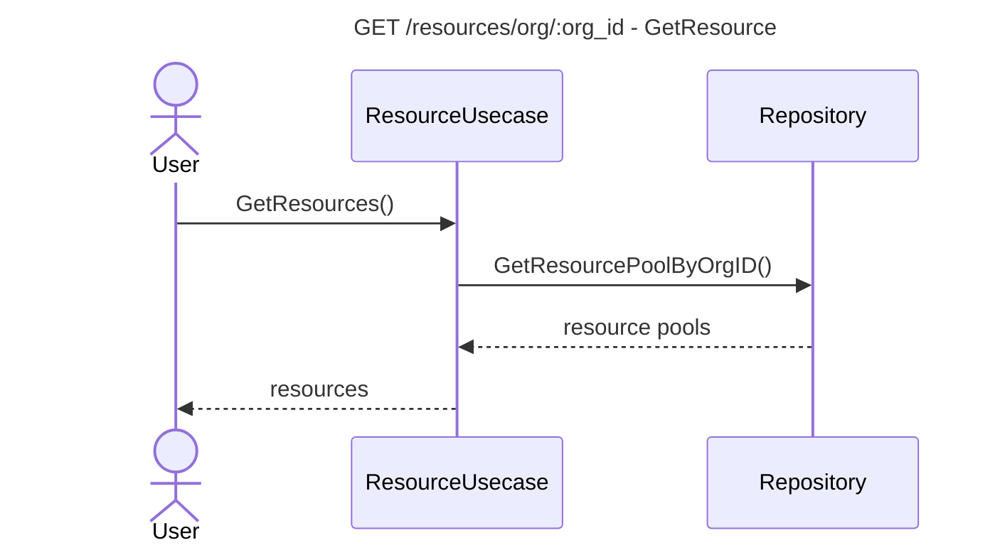
```mermaid
---
title: GET /resources/org/:org_id - GetResource
---
sequenceDiagram
    actor User
    participant ResourceUsecase
    participant Repository

    User->>ResourceUsecase: GetResources()
    ResourceUsecase->>Repository: GetResourcePoolByOrgID()
    Repository-->>ResourceUsecase: resource pools
    ResourceUsecase-->>User: resources
```

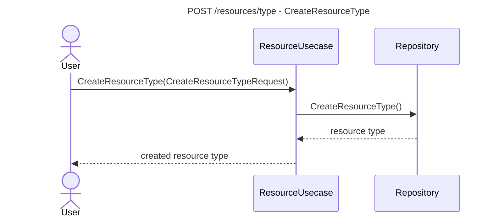
```mermaid
---
title: POST /resources/type - CreateResourceType
---
sequenceDiagram
    actor User
    participant ResourceUsecase
    participant Repository

    User->>ResourceUsecase: CreateResourceType(CreateResourceTypeRequest)
    ResourceUsecase->>Repository: CreateResourceType()
    Repository-->>ResourceUsecase: resource type
    ResourceUsecase-->>User: created resource type
```

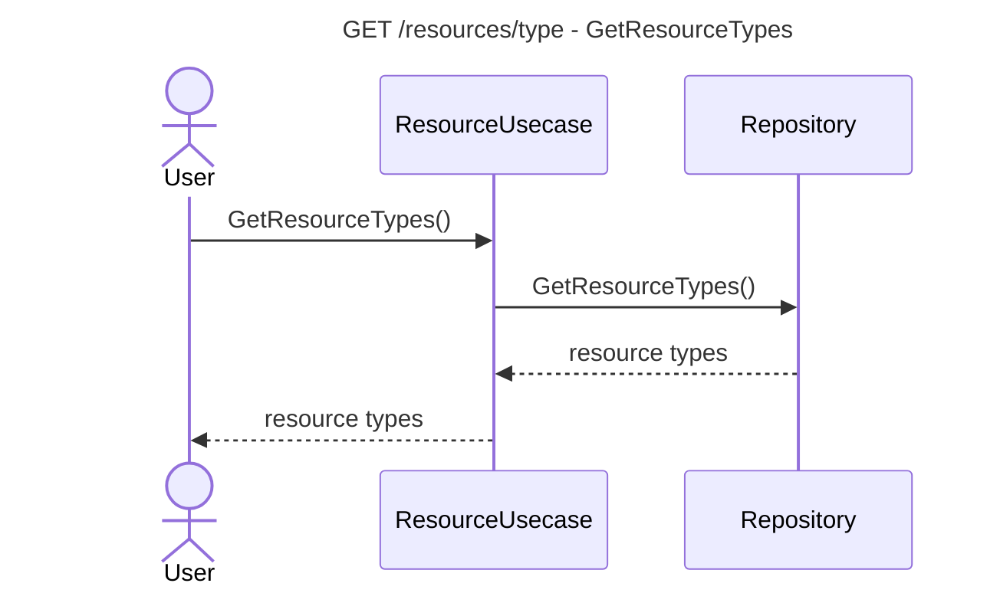
```mermaid
---
title: GET /resources/type - GetResourceTypes
---
sequenceDiagram
    actor User
    participant ResourceUsecase
    participant Repository

    User->>ResourceUsecase: GetResourceTypes()
    ResourceUsecase->>Repository: GetResourceTypes()
    Repository-->>ResourceUsecase: resource types
    ResourceUsecase-->>User: resource types
```

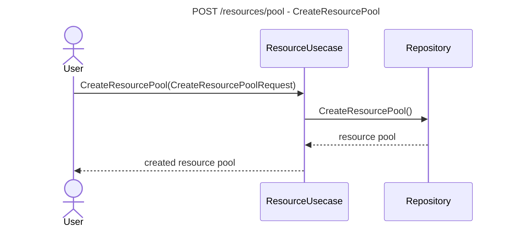
```mermaid
---
title: POST /resources/pool - CreateResourcePool
---
sequenceDiagram
    actor User
    participant ResourceUsecase
    participant Repository

    User->>ResourceUsecase: CreateResourcePool(CreateResourcePoolRequest)
    ResourceUsecase->>Repository: CreateResourcePool()
    Repository-->>ResourceUsecase: resource pool
    ResourceUsecase-->>User: created resource pool
```

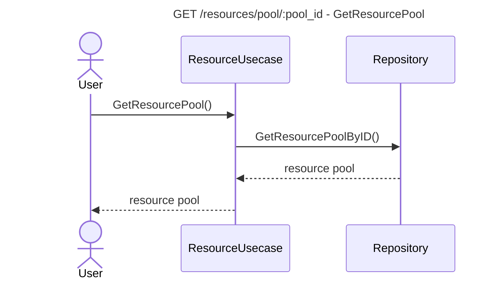
```mermaid
---
title: GET /resources/pool/:pool_id - GetResourcePool
---
sequenceDiagram
    actor User
    participant ResourceUsecase
    participant Repository

    User->>ResourceUsecase: GetResourcePool()
    ResourceUsecase->>Repository: GetResourcePoolByID()
    Repository-->>ResourceUsecase: resource pool
    ResourceUsecase-->>User: resource pool
```

```mermaid
---
title: PATCH /resources/pool/:pool_id - UpdateResourcePool
---
sequenceDiagram
    actor User
    participant ResourceUsecase
    participant Repository

    User->>ResourceUsecase: UpdateResourcePool(UpdateResourcePoolRequest)
    ResourceUsecase->>Repository: GetResourcePoolByID()
    ResourceUsecase->>Repository: UpdateResourcePool()
    Repository-->>ResourceUsecase: resource pool
    ResourceUsecase-->>User: updated resource pool
```

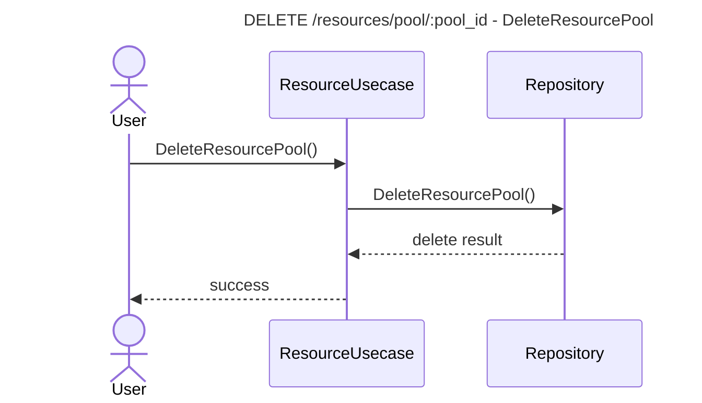
```mermaid
---
title: DELETE /resources/pool/:pool_id - DeleteResourcePool
---
sequenceDiagram
    actor User
    participant ResourceUsecase
    participant Repository

    User->>ResourceUsecase: DeleteResourcePool()
    ResourceUsecase->>Repository: DeleteResourcePool()
    Repository-->>ResourceUsecase: delete result
    ResourceUsecase-->>User: success
```

```mermaid
---
title: POST /resources/node - CreateResourceNode
---
sequenceDiagram
    actor User
    participant ResourceUsecase
    participant Repository

    User->>ResourceUsecase: CreateResourceNode(CreateResourceNodeRequest)
    ResourceUsecase->>Repository: CreateResourceNode()
    Repository-->>ResourceUsecase: resource node
    ResourceUsecase-->>User: created resource node
```

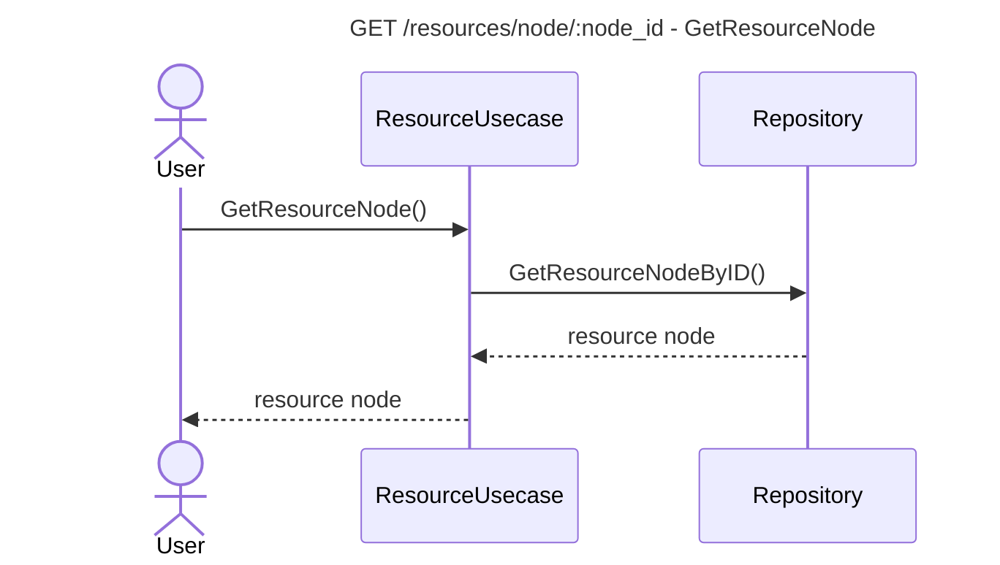
```mermaid
---
title: GET /resources/node/:node_id - GetResourceNode
---
sequenceDiagram
    actor User
    participant ResourceUsecase
    participant Repository

    User->>ResourceUsecase: GetResourceNode()
    ResourceUsecase->>Repository: GetResourceNodeByID()
    Repository-->>ResourceUsecase: resource node
    ResourceUsecase-->>User: resource node
```

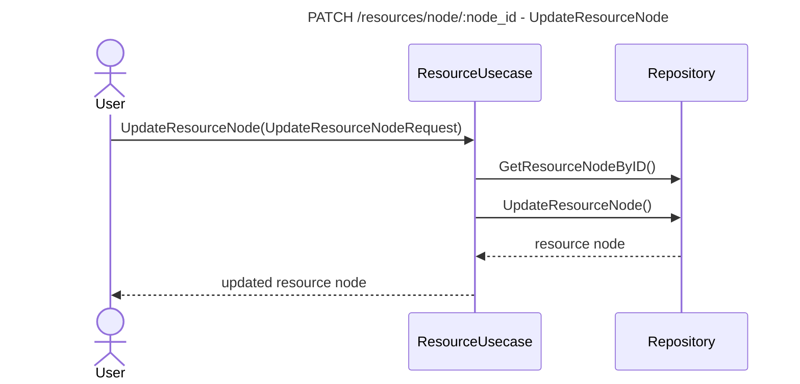
```mermaid
---
title: PATCH /resources/node/:node_id - UpdateResourceNode
---
sequenceDiagram
    actor User
    participant ResourceUsecase
    participant Repository

    User->>ResourceUsecase: UpdateResourceNode(UpdateResourceNodeRequest)
    ResourceUsecase->>Repository: GetResourceNodeByID()
    ResourceUsecase->>Repository: UpdateResourceNode()
    Repository-->>ResourceUsecase: resource node
    ResourceUsecase-->>User: updated resource node
```

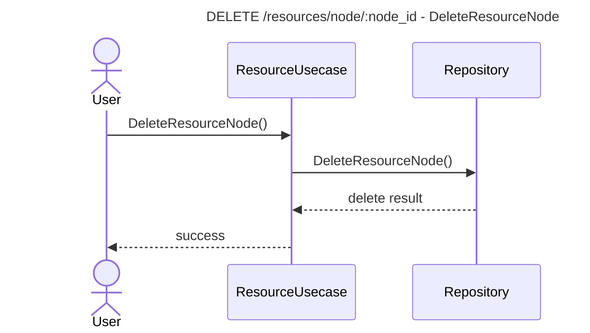
```mermaid
---
title: DELETE /resources/node/:node_id - DeleteResourceNode
---
sequenceDiagram
    actor User
    participant ResourceUsecase
    participant Repository

    User->>ResourceUsecase: DeleteResourceNode()
    ResourceUsecase->>Repository: DeleteResourceNode()
    Repository-->>ResourceUsecase: delete result
    ResourceUsecase-->>User: success
```

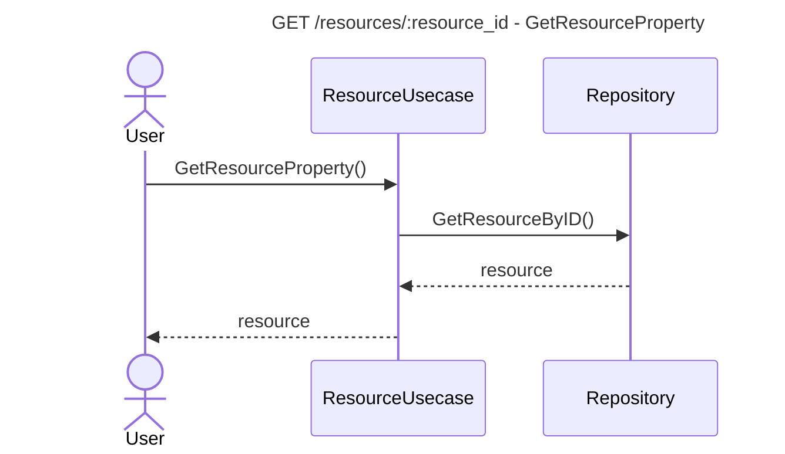
```mermaid
---
title: GET /resources/:resource_id - GetResourceProperty
---
sequenceDiagram
    actor User
    participant ResourceUsecase
    participant Repository

    User->>ResourceUsecase: GetResourceProperty()
    ResourceUsecase->>Repository: GetResourceByID()
    Repository-->>ResourceUsecase: resource
    ResourceUsecase-->>User: resource
```

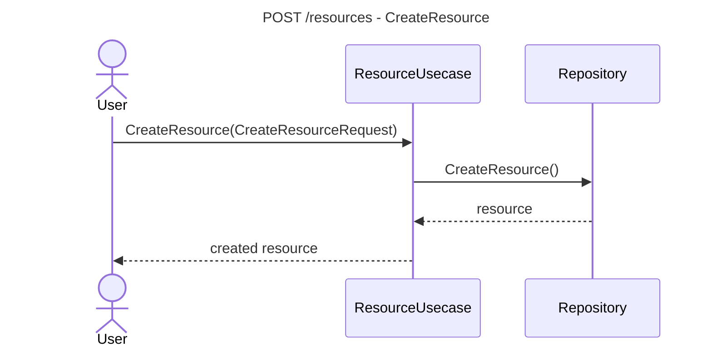
```mermaid
---
title: POST /resources - CreateResource
---
sequenceDiagram
    actor User
    participant ResourceUsecase
    participant Repository

    User->>ResourceUsecase: CreateResource(CreateResourceRequest)
    ResourceUsecase->>Repository: CreateResource()
    Repository-->>ResourceUsecase: resource
    ResourceUsecase-->>User: created resource
```

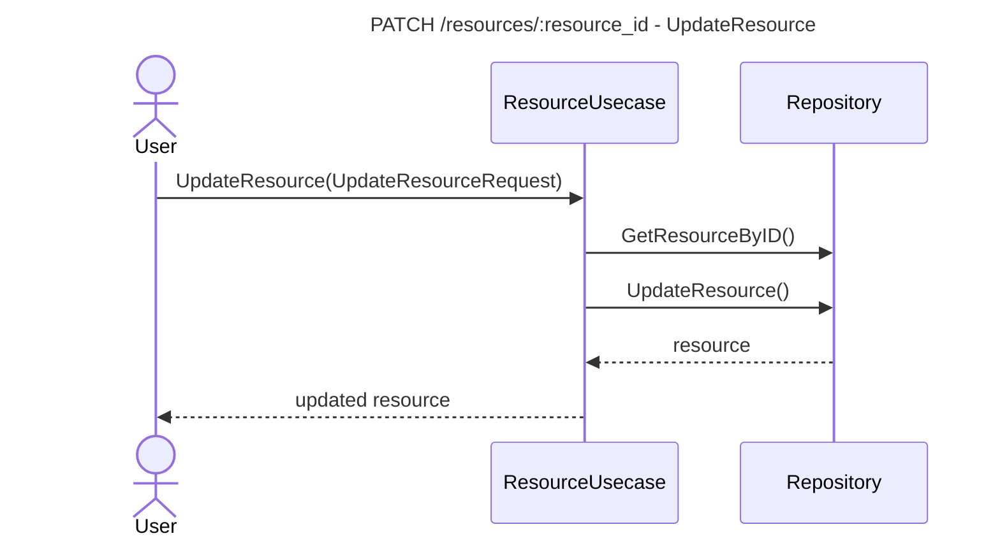
```mermaid
---
title: PATCH /resources/:resource_id - UpdateResource
---
sequenceDiagram
    actor User
    participant ResourceUsecase
    participant Repository

    User->>ResourceUsecase: UpdateResource(UpdateResourceRequest)
    ResourceUsecase->>Repository: GetResourceByID()
    ResourceUsecase->>Repository: UpdateResource()
    Repository-->>ResourceUsecase: resource
    ResourceUsecase-->>User: updated resource
```

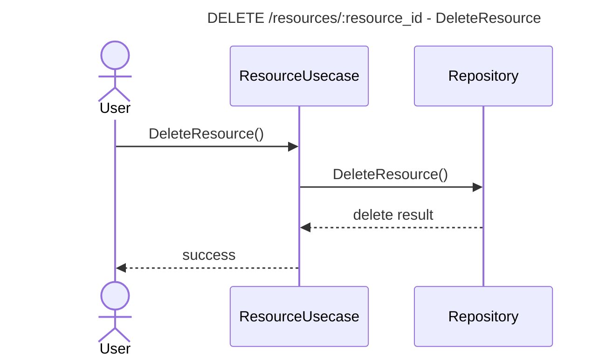
```mermaid
---
title: DELETE /resources/:resource_id - DeleteResource
---
sequenceDiagram
    actor User
    participant ResourceUsecase
    participant Repository

    User->>ResourceUsecase: DeleteResource()
    ResourceUsecase->>Repository: DeleteResource()
    Repository-->>ResourceUsecase: delete result
    ResourceUsecase-->>User: success
```
