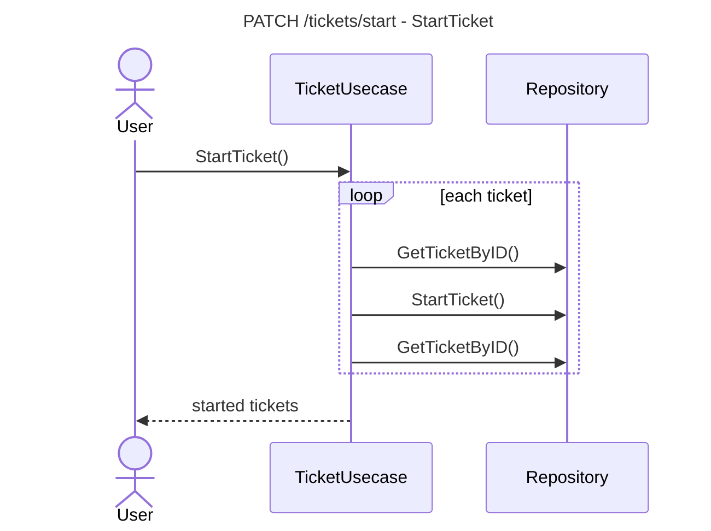
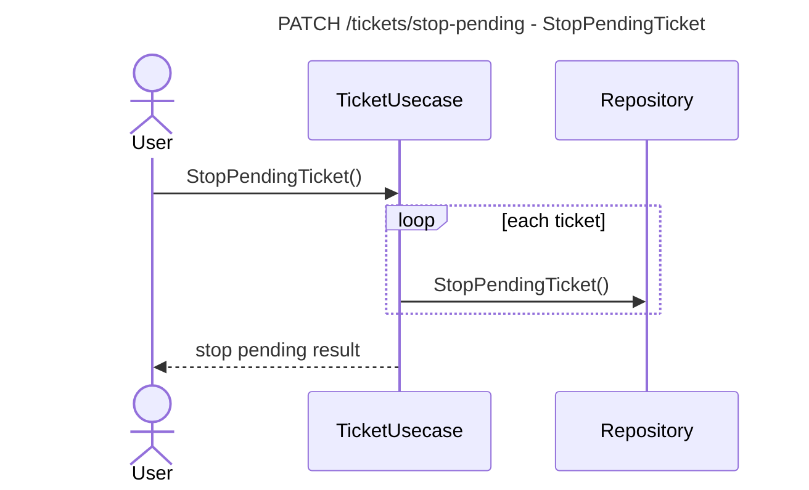
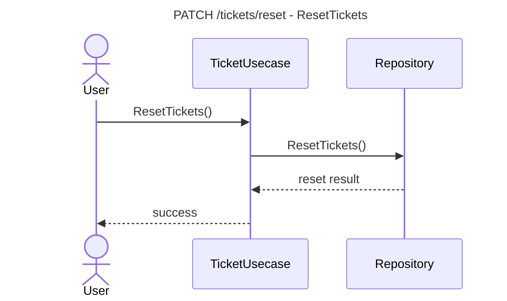
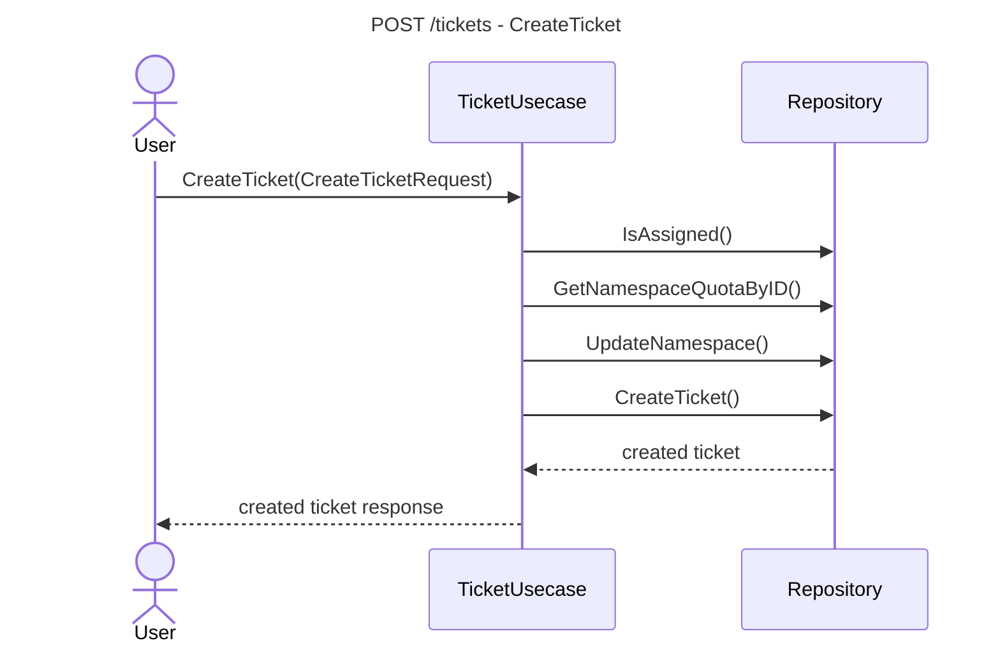
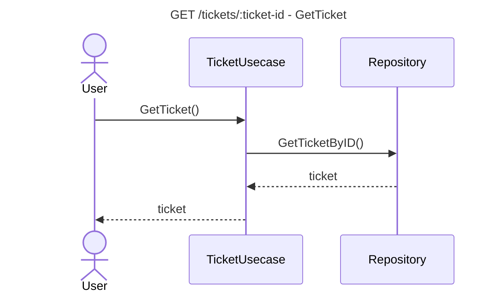
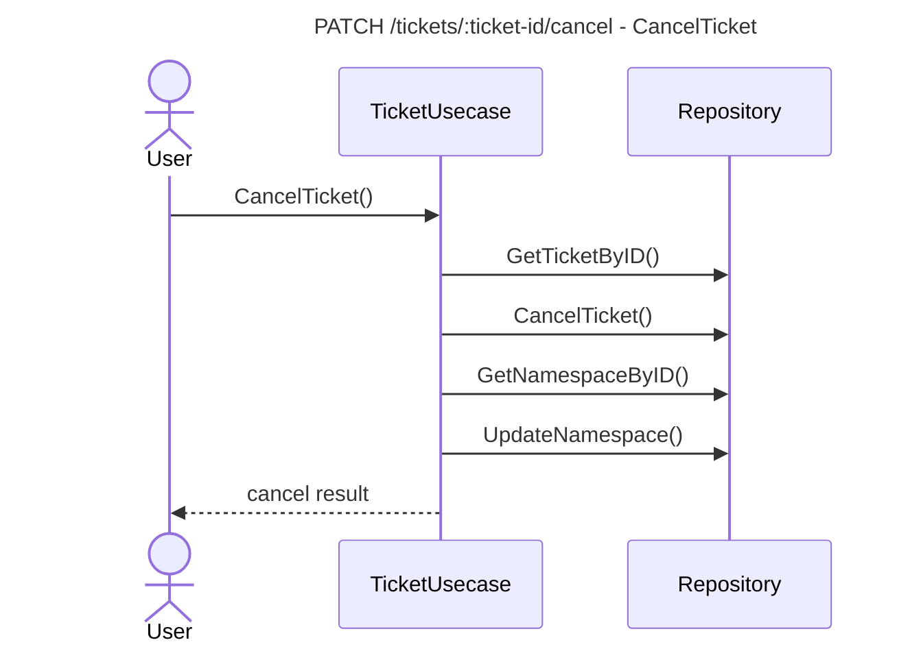
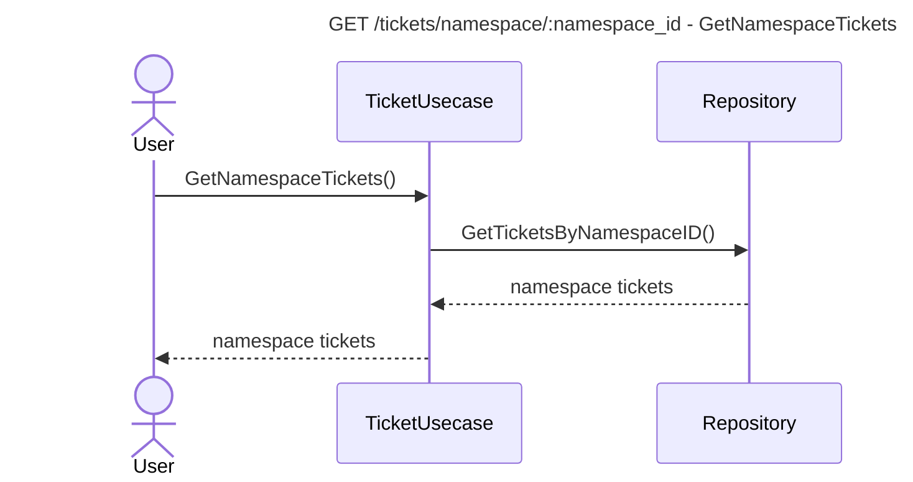
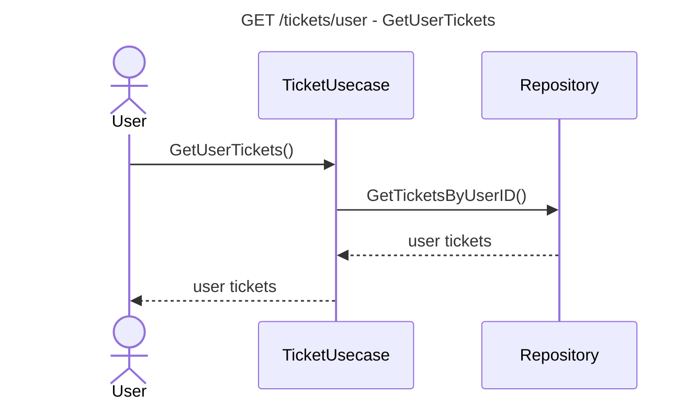
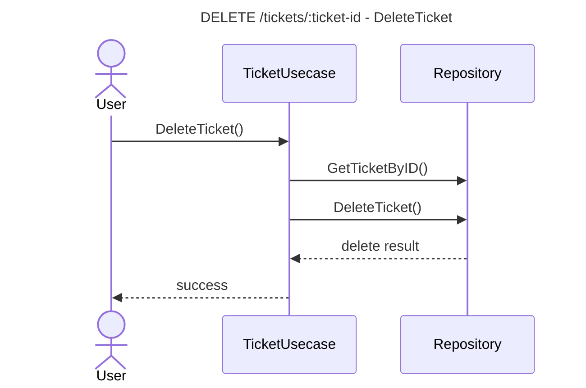

```mermaid
---
title: PATCH /tickets/start - StartTicket
---
sequenceDiagram
    actor User
    participant TicketUsecase
    participant Repository

    User->>TicketUsecase: StartTicket()
    loop each ticket
        TicketUsecase->>Repository: GetTicketByID()
        TicketUsecase->>Repository: StartTicket()
        TicketUsecase->>Repository: GetTicketByID()
    end
    TicketUsecase-->>User: started tickets
```

```mermaid
---
title: PATCH /tickets/stop-pending - StopPendingTicket
---
sequenceDiagram
    actor User
    participant TicketUsecase
    participant Repository

    User->>TicketUsecase: StopPendingTicket()
    loop each ticket
        TicketUsecase->>Repository: StopPendingTicket()
    end
    TicketUsecase-->>User: stop pending result
```

```mermaid
---
title: PATCH /tickets/stop - StopTicket
---
sequenceDiagram
    actor User
    participant TicketUsecase
    participant Repository

    User->>TicketUsecase: StopTicket()
    loop each ticket
        TicketUsecase->>Repository: GetTicketByID()
        TicketUsecase->>Repository: StopTicket()
        TicketUsecase->>Repository: GetTicketByID()
    end
    TicketUsecase-->>User: stopped tickets
```

```mermaid
---
title: PATCH /tickets/reset - ResetTickets
---
sequenceDiagram
    actor User
    participant TicketUsecase
    participant Repository

    User->>TicketUsecase: ResetTickets()
    TicketUsecase->>Repository: ResetTickets()
    Repository-->>TicketUsecase: reset result
    TicketUsecase-->>User: success
```

```mermaid
---
title: POST /tickets - CreateTicket
---
sequenceDiagram
    actor User
    participant TicketUsecase
    participant Repository

    User->>TicketUsecase: CreateTicket(CreateTicketRequest)
    TicketUsecase->>Repository: IsAssigned()
    TicketUsecase->>Repository: GetNamespaceQuotaByID()
    TicketUsecase->>Repository: UpdateNamespace()
    TicketUsecase->>Repository: CreateTicket()
    Repository-->>TicketUsecase: created ticket
    TicketUsecase-->>User: created ticket response
```

```mermaid
---
title: GET /tickets/:ticket-id - GetTicket
---
sequenceDiagram
    actor User
    participant TicketUsecase
    participant Repository

    User->>TicketUsecase: GetTicket()
    TicketUsecase->>Repository: GetTicketByID()
    Repository-->>TicketUsecase: ticket
    TicketUsecase-->>User: ticket
```

```mermaid
---
title: PATCH /tickets/:ticket-id/cancel - CancelTicket
---
sequenceDiagram
    actor User
    participant TicketUsecase
    participant Repository

    User->>TicketUsecase: CancelTicket()
    TicketUsecase->>Repository: GetTicketByID()
    TicketUsecase->>Repository: CancelTicket()
    TicketUsecase->>Repository: GetNamespaceByID()
    TicketUsecase->>Repository: UpdateNamespace()
    TicketUsecase-->>User: cancel result
```

```mermaid
---
title: GET /tickets/namespace/:namespace_id - GetNamespaceTickets
---
sequenceDiagram
    actor User
    participant TicketUsecase
    participant Repository

    User->>TicketUsecase: GetNamespaceTickets()
    TicketUsecase->>Repository: GetTicketsByNamespaceID()
    Repository-->>TicketUsecase: namespace tickets
    TicketUsecase-->>User: namespace tickets
```

```mermaid
---
title: GET /tickets/user - GetUserTickets
---
sequenceDiagram
    actor User
    participant TicketUsecase
    participant Repository

    User->>TicketUsecase: GetUserTickets()
    TicketUsecase->>Repository: GetTicketsByUserID()
    Repository-->>TicketUsecase: user tickets
    TicketUsecase-->>User: user tickets
```

```mermaid
---
title: DELETE /tickets/:ticket-id - DeleteTicket
---
sequenceDiagram
    actor User
    participant TicketUsecase
    participant Repository

    User->>TicketUsecase: DeleteTicket()
    TicketUsecase->>Repository: GetTicketByID()
    TicketUsecase->>Repository: DeleteTicket()
    Repository-->>TicketUsecase: delete result
    TicketUsecase-->>User: success
```
