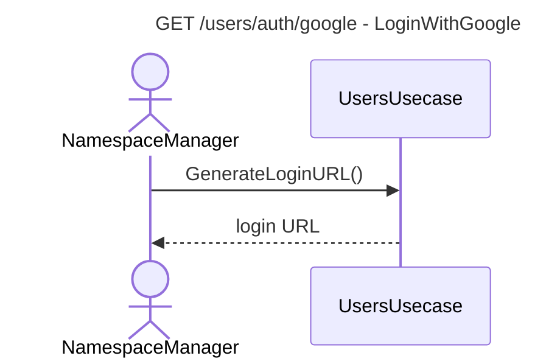
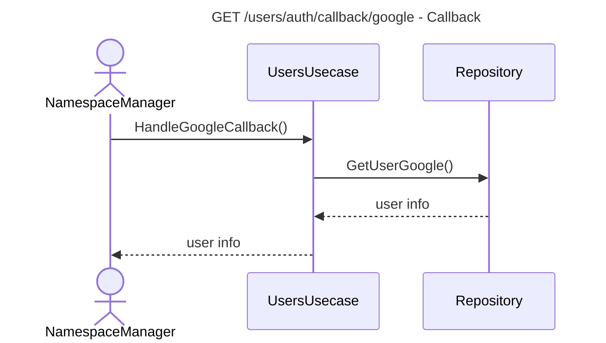
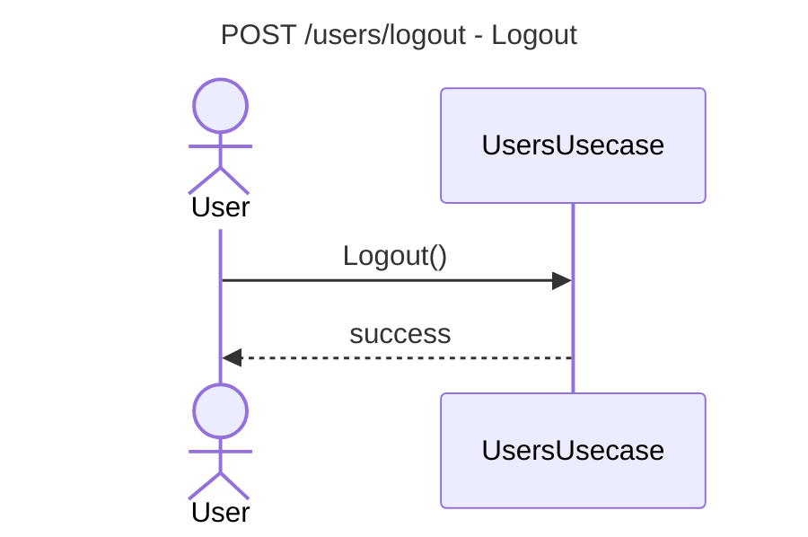
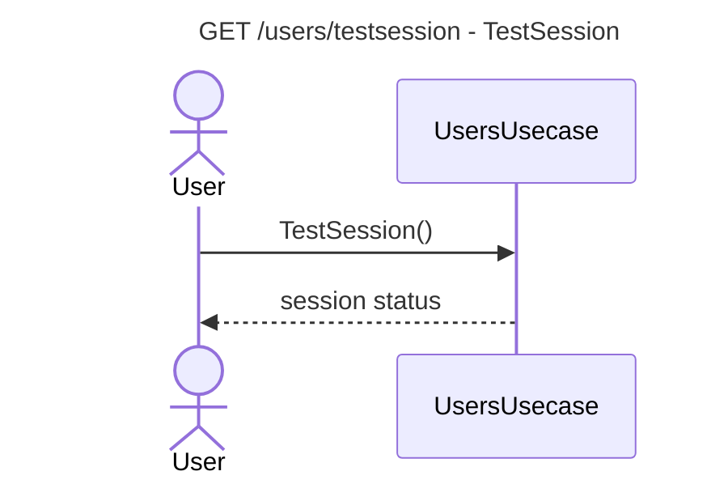

```mermaid
---
title: GET /users/auth/google - LoginWithGoogle
---
sequenceDiagram
    actor NamespaceManager
    participant UsersUsecase

    NamespaceManager->>UsersUsecase: GenerateLoginURL()
    UsersUsecase-->>NamespaceManager: login URL
```

```mermaid
---
title: GET /users/auth/callback/google - Callback
---
sequenceDiagram
    actor NamespaceManager
    participant UsersUsecase
    participant Repository

    NamespaceManager->>UsersUsecase: HandleGoogleCallback()
    UsersUsecase->>Repository: GetUserGoogle()
    Repository-->>UsersUsecase: user info
    UsersUsecase-->>NamespaceManager: user info
```

```mermaid
---
title: POST /users/logout - Logout
---
sequenceDiagram
    actor User
    participant UsersUsecase

    User->>UsersUsecase: Logout()
    UsersUsecase-->>User: success
```

```mermaid
---
title: GET /users/testsession - TestSession
---
sequenceDiagram
    actor User
    participant UsersUsecase

    User->>UsersUsecase: TestSession()
    UsersUsecase-->>User: session status
```
